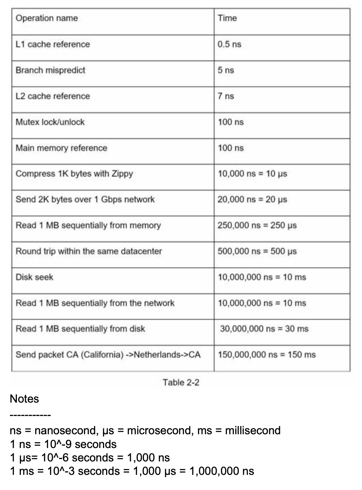
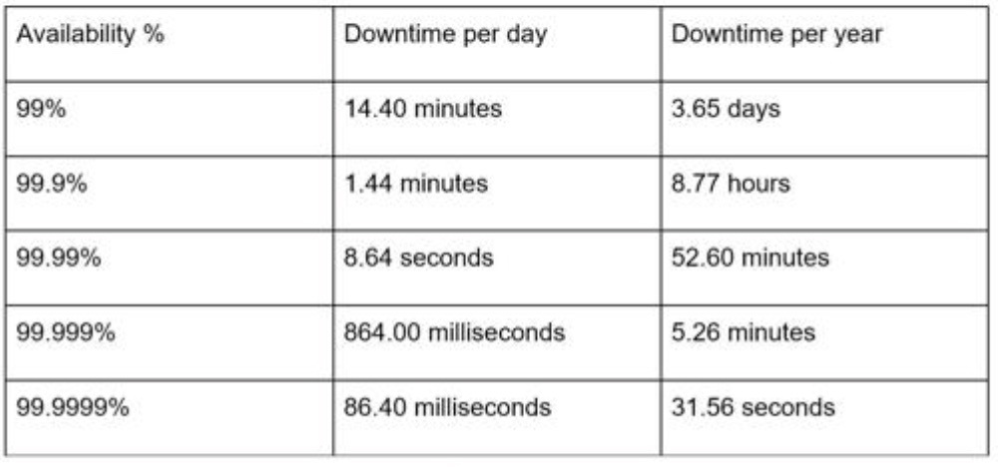
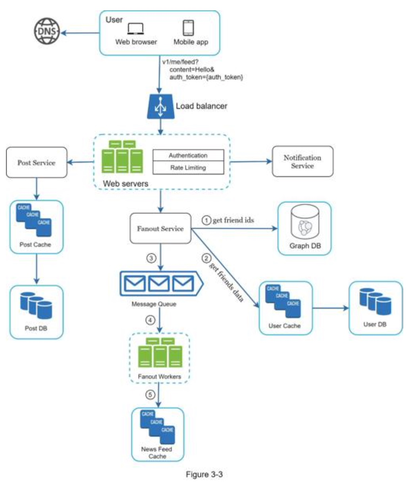
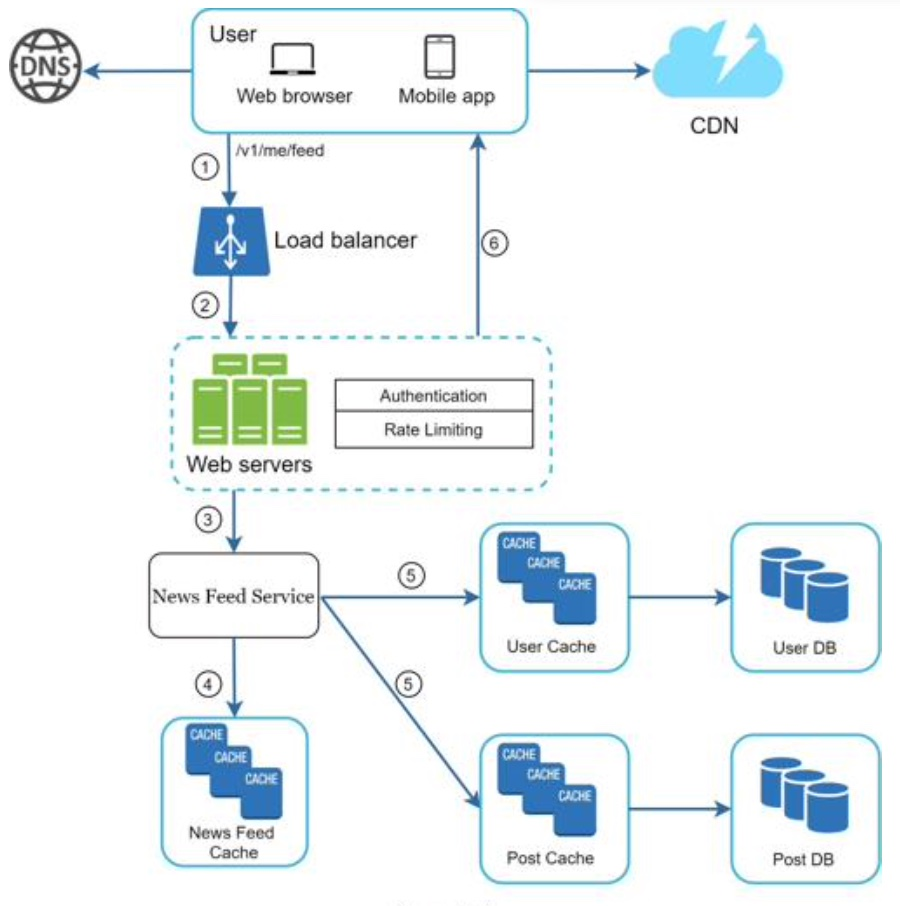

# System Design Interview

## Chapter 1: Scale from zero to millions of users

### Singleton web server data flow:

request domain -> domain server -> get IP -> Http request -> fetch data from database -> Http response

### Database

- relational database management system (RDBMS) = SQL database
- Non-relational databases = NoSQL databases 联表查询不支持
	- key-value stores,
	- graph stores,
	- column stores, and
	- document stores.
- Non-relational databases might be the right choice if:
	- Your application requires super-low latency. 低延迟需求
	- Your data are unstructured, or you do not have any relational data. 非结构化的数据，非关系型数据
	- You only need to serialize and deserialize data (JSON, XML, YAML, etc.). 只要序列化与反序列化数据
	- You need to store a massive amount of data. 需要存储天量的数据
- Example: CouchDB, Neo4j, Cassandra, HBase, Amazon DynamoDB

### Vertical scaling vs horizontal scaling 垂直扩展与横向扩展

- scale up 垂直扩展：给原有服务器加 CPU，内存，硬盘等。有严重的短板。
- scale out 横向扩展：加服务器

#### Load balance

DNS 解析到 负载均衡器 load balancer 的公有 IP，由负载均衡器平均地分发请求量到真实的服务器的私有 IP 上。

#### Data replication 数据库备份

- master/slave relationship
- master support write operation
- slave support read operation and sync data from master
- advantages:
	- 更好的性能，允许更多的并行查询
	- 可靠性，容灾备份，单节点挂掉，不丢失数据。
	- 高可用性，单节点挂掉，其他节点可以提供服务。
- 只有一个主数据库，并且这个主数据库挂掉怎么办：
	- 从 slave 数据库中选出一个主数据库
	- 同步缺失的数据到新的主数据库中，run data recovery scrips
	- 新增一个 slave 数据库用于弥补少了的一个。
	- 高级而复杂的替代方案：
		- 多个主数据库 multi-masters
		- 循环备份 circular replication？

### Cache 缓存

A cache is a temporary storage area that stores the result of expensive responses or frequently accessed data in memory
so that subsequent requests are served more quickly

- 存储耗费资源的结果/响应，特别是访问数据库。
- 存储频繁被访问的结果/响应，降低数据库的工作量
- 提升以后请求的响应效率

什么时候使用缓存？

- 数据访问频繁，而修改不频繁。重要的数据还是存储在永久介质中（例如database）
- 过期策略，过长与过短都不好，平衡点的选择
- 一致性问题，修改数据之后，数据存储与缓存的不一致问题
- 避免单点故障，需要多台缓存服务器。 single point of failure(SPOF)
- 溢出策略 eviction policy。缓存空间满了之后，如果有新的key添加，需要主动删除。
	- Least-Recently-Used(LRU) 最近最少使用
	- Least-Frequently-Used(LFU) 最少使用
	- First-In-First-Out(FIFO) 先进先出

### Content Delivery Network (CDN)

A CDN is a network of geographically dispersed servers used to deliver static content. CDN servers cache static content
like images, videos, CSS, JavaScript files, etc.

- 基于地理位置分散的服务器，（maybe geoDNS-routed/geo-routed）
- 分发静态内容：图片，视频，CSS，JS

The URL’s domain is provided by the CDN provider. 配备了 CDN 的静态资源的 URL，通常指向 CDN server。

Time-to-live (TTL) 设置也需要平衡，不可过短与过长

CDN fallback CDN撤退，客户端需要检测到 CND 健康状态，当 CDN 服务器挂掉之后，需要访问自己的真实服务器获取资源

主动使 CDN 上文件失效

- 调用 CDN API
- 使用资源的版本号

### 无状态 web 层 stateless web tier

#### stateful 有状态的弊端：

如果是有状态的 web 服务，并且是多服务器的，那么 A用户的 session 存储在 A服务器，他的每一个接下来的请求都必须指向 A服务器，
否则他就是一个未登录状态。添加和删除服务器会很麻烦，服务器挂掉的容灾处理也麻烦。

#### 无状态web层的优点

- simple 简单
- robust 健壮
- scalable 可扩展

把 session 从 web 层移动到存储层（例如关系型数据库，Redis，NoSQL）

### Data Center 数据中心

geoDNS-routed = geo-routed

geoDNS is a DNS service that allows domain names to be resolved to IP addresses based on the location of a user.

challenges of multi-data center setup:

- Traffic redirection 流量重定向 GeoDNS
- Data synchronization 数据同步
- Test at different locations 多地理位置测试
- Auto Deployment to keep services consistent 服务一致性

### Message Queue

decouple different components to scale independently.
解耦不同组件，以使各个组件模块独立的扩展规模

A message queue is a durable component, stored in memory, that supports asynchronous communication. It serves as a
buffer and distributes asynchronous requests.

- 存储在内存中的
- 异步通信的，只要消息队列有消息，并且没有溢出，消费者和生产者不需要互相等待
- buffer 缓冲区作用的
- 分发异步请求
- publisher/producer <--> subscriber/consumer

### logging, metrics, automation, monitoring

metrics:

- Host level metrics:
	- CPU
	- memory
	- disk I/O
- aggregated level metrics 聚合指标：
	- the performance of database tier
	- the performance of cache tier
- Key business metrics:
	- daily active users
	- retention
	- revenue
	- the QPS

### Database scaling

分片 sharding

hash function 哈希函数来决定数据被存储到哪一个片，和应该去哪一个片读取数据。例如 user_id%4 4个分片。

sharding key = partition key 决定数据怎么被分发，例如 user_id 就是 sharding-key。此key必须可以平均的分配数据

challenges:

- resharding data 重新切片数据
	- 单切片节点超容量了
	- 分配不均。一致性哈希 consistent hashing
- celebrity problem/ hotspot key problem 热点 key 被分到同一个 shard导致该shard 过载。
- Join and de-normalization: Once a database has been sharded across multiple servers, it is hard to perform join
  operations across database shards. A common workaround is to de-normalize the database so that queries can be
  performed in a single table. 联表查询，粗糙的解决办法是把多张表的 schema 设计在一张表中。

### Conclusion of chapter 1

- Keep web tier stateless
- Build redundancy at every tier
- Cache data as much as you can
- Support multiple data centers
- Host static assets in CDN
- Scale your data tier by sharding
- Split tiers into individual services
- Monitor your system and use automation tools

## Chapter 2: Back of the envelope estimation 信封背面估算

### Latency numbers 延迟数字

- Memory is fast but the disk is slow.
- Avoid disk seeks if possible.
- Simple compression algorithms are fast.
- Compress data before sending it over the internet if possible.
- Data centers are usually in different regions, and it takes time to send data between them.

### Availability numbers

service level agreement (SLA).
9 越多越好

### Example

Assumptions:

- 300 million monthly active users.
- 50% of users use Twitter daily.
- Users post 2 tweets per day on average. - 10% of tweets contain media.
- Data is stored for 5 years.

Estimations:

Query per second (QPS) estimate:

- Daily active users (DAU) = 300 million * 50% = 150 million
- Tweets QPS = 150 million * 2 tweets / 24 hour / 3600 seconds = ~3500
- Peak QPS = 2 * QPS = ~7000

We will only estimate media storage here.

- Average tweet size:
- tweet_id 64 bytes
- text 140 bytes - media 1 MB
- Media storage: 150 million * 2 * 10% * 1 MB = 30 TB per day 30,000,000 MB
- 5-year media storage: 30 TB * 365 * 5 = ~55 PB

## Chapter 3: A framework for system design interview

- The problem is open-ended, 开发式的
- and there is no perfect answer. 没有标准答案
- The final design is less important compared to the work you put in the design process. 设计的过程很重要
- This allows you to demonstrate your design skill, 展示设计技能
- defend your design choices, 为设计选型辩护，为什么好，为什么适合
- and respond to feedback in a constructive manner.

面试者需要展示的是：

- technical design skills. 设计技能只是一小部份
- a person's ability to collaborate, 合作能力
- to work under pressure, 抗压能力
- and to resolve ambiguity constructively. 建设性地解决模棱两可的问题
- The ability to ask good questions 问正确而高效的问题

red flags：

- Over-engineering 过度设计
- delight in design purity
- and ignore tradeoffs. 忽略折中
- unaware of the compounding costs of over-engineered systems 不考虑综合承包
- narrow mindedness, 钻牛角尖
- stubbornness 顽固

### 4 setps

#### Step 1 - Understand the problem and establish design scope. 需要全面理解问题，并了解设计的范围, 3-10 minutes

Answering without a thorough understanding of the requirements is a huge red flag.  
Slow down. Think deeply and ask questions to clarify requirements and assumptions. This is extremely important.
澄清需求和猜想。

- ask the right questions, 用于提问
	- What specific features are we going to build? 具体的功能点
	- How many users does the product have? 用户量
	- How fast does the company anticipate to scale up?
	- What are the anticipated scales in 3 months, 6 months, and a
	  year? 预期规模的增幅
	- What is the company’s technology stack? 当前公司的技术栈
	- What existing services you might leverage to simplify the design? 有哪些现有的服务模块
- make the proper assumptions,
	- write down your assumptions on the whiteboard or paper. You might need them later. 写下猜想，以备后用。
- and gather all the information needed to build a system

#### Step 2 - Propose high-level design and get buy-in, 提出一个高层的笼统的设计并买进, 10-15 minutes

- Come up with an initial blueprint for the design. Ask for feedback. 把面试官当作队友，一起合作
- Draw box diagrams with key components on the whiteboard or paper. 画框图
  This might include:
	- clients (mobile/web),
	- APIs,
	- web servers,
	- data stores,
	- cache,
	- CDN,
	- message queue, etc.
- Do back-of-the-envelope calculations to evaluate if your blueprint fits the scale constraints. 评估设计蓝图是否满足扩容限制。
- go through a few concrete use cases 过一遍具体的用户实例，发现边缘实例 edge case
- 是否需要 API endpoints and database schema，得看具体设计题目，或者问面试官

#### Step 3 - Design deep dive, 深入的设计， 10-25 minutes

You shall work with the interviewer to identify and prioritize components in the architecture.
该着重剖析高优先级的组件模块了

- Design the most critical components first.
- system performance characteristics,
	- likely focusing on the bottlenecks 系统瓶颈
	- and resource estimations 所需资源估算
- dig into details of some system components.
	- URL shortener -> hash function design
	- chat system -> how to reduce latency and how to support online/offline status
- Try not to get into unnecessary details. Time management

发布新帖子

订阅朋友圈更新

#### Step 4 - Wrap up, 打包结束， 3-5 minutes

- The interviewer might want you to identify the system bottlenecks and discuss potential improvements. critical
  thinking 可以改进的地方
- It could be useful to give the interviewer a recap of your design. 总结
- Error cases (server failure, network loss, etc.)  错误实例：服务器错误，网络抖动
- monitor metrics and error logs 监控指标，错误日志审查
- How to roll out the system? 如何部署系统
- How to handle the next scale curve 如何为下一次系统扩容做准备，例如100万用户到1000万用户。

### Conclusion

- Don’t go into too much detail on a single component in the beginning. Give the high-level design first then drills
  down.
- If you get stuck, don't hesitate to ask for hints.
- Again, communicate. Don't think in silence.
- Don’t think your interview is done once you give the design. You are not done until your interviewer says you are
  done. Ask for feedback early and often.

## References

- "System Design Interview An Insider's Guide" by Alex Xu
- 
