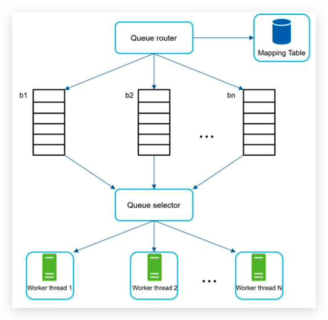
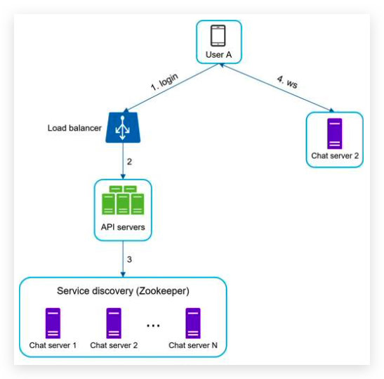

# System Design Interview

## Chapter 1: Scale from zero to millions of users

### Singleton web server data flow:

request domain -> domain server -> get IP -> Http request -> fetch data from database -> Http response

### Database

- relational database management system (RDBMS) = SQL database
- Non-relational databases = NoSQL databases 联表查询不支持
	- key-value stores,
	- graph stores,
	- column stores, and
	- document stores.
- Non-relational databases might be the right choice if:
	- Your application requires super-low latency. 低延迟需求
	- Your data are unstructured, or you do not have any relational data. 非结构化的数据，非关系型数据
	- You only need to serialize and deserialize data (JSON, XML, YAML, etc.). 只要序列化与反序列化数据
	- You need to store a massive amount of data. 需要存储天量的数据
- Example: CouchDB, Neo4j, Cassandra, HBase, Amazon DynamoDB

### Vertical scaling vs horizontal scaling 垂直扩展与横向扩展

- scale up 垂直扩展：给原有服务器加 CPU，内存，硬盘等。有严重的短板。
- scale out 横向扩展：加服务器

#### Load balance

DNS 解析到 负载均衡器 load balancer 的公有 IP，由负载均衡器平均地分发请求量到真实的服务器的私有 IP 上。

#### Data replication 数据库备份

- master/slave relationship
- master support write operation
- slave support read operation and sync data from master
- advantages:
	- 更好的性能，允许更多的并行查询
	- 可靠性，容灾备份，单节点挂掉，不丢失数据。
	- 高可用性，单节点挂掉，其他节点可以提供服务。
- 只有一个主数据库，并且这个主数据库挂掉怎么办：
	- 从 slave 数据库中选出一个主数据库
	- 同步缺失的数据到新的主数据库中，run data recovery scrips
	- 新增一个 slave 数据库用于弥补少了的一个。
	- 高级而复杂的替代方案：
		- 多个主数据库 multi-masters
		- 循环备份 circular replication？

### Cache 缓存

A cache is a temporary storage area that stores the result of expensive responses or frequently accessed data in memory
so that subsequent requests are served more quickly

- 存储耗费资源的结果/响应，特别是访问数据库。
- 存储频繁被访问的结果/响应，降低数据库的工作量
- 提升以后请求的响应效率

什么时候使用缓存？

- 数据访问频繁，而修改不频繁。重要的数据还是存储在永久介质中（例如database）
- 过期策略，过长与过短都不好，平衡点的选择
- 一致性问题，修改数据之后，数据存储与缓存的不一致问题
- 避免单点故障，需要多台缓存服务器。 single point of failure(SPOF)
- 溢出策略 eviction policy。缓存空间满了之后，如果有新的key添加，需要主动删除。
	- Least-Recently-Used(LRU) 最近最少使用
	- Least-Frequently-Used(LFU) 最少使用
	- First-In-First-Out(FIFO) 先进先出

### Content Delivery Network (CDN)

A CDN is a network of geographically dispersed servers used to deliver static content. CDN servers cache static content
like images, videos, CSS, JavaScript files, etc.

- 基于地理位置分散的服务器，（maybe geoDNS-routed/geo-routed）
- 分发静态内容：图片，视频，CSS，JS

The URL’s domain is provided by the CDN provider. 配备了 CDN 的静态资源的 URL，通常指向 CDN server。

Time-to-live (TTL) 设置也需要平衡，不可过短与过长

CDN fallback CDN撤退，客户端需要检测到 CND 健康状态，当 CDN 服务器挂掉之后，需要访问自己的真实服务器获取资源

主动使 CDN 上文件失效

- 调用 CDN API
- 使用资源的版本号

### 无状态 web 层 stateless web tier

#### stateful 有状态的弊端：

如果是有状态的 web 服务，并且是多服务器的，那么 A用户的 session 存储在 A服务器，他的每一个接下来的请求都必须指向 A服务器，
否则他就是一个未登录状态。添加和删除服务器会很麻烦，服务器挂掉的容灾处理也麻烦。

#### 无状态web层的优点

- simple 简单
- robust 健壮
- scalable 可扩展

把 session 从 web 层移动到存储层（例如关系型数据库，Redis，NoSQL）

### Data Center 数据中心

geoDNS-routed = geo-routed

geoDNS is a DNS service that allows domain names to be resolved to IP addresses based on the location of a user.

challenges of multi-data center setup:

- Traffic redirection 流量重定向 GeoDNS
- Data synchronization 数据同步
- Test at different locations 多地理位置测试
- Auto Deployment to keep services consistent 服务一致性

### Message Queue

decouple different components to scale independently.
解耦不同组件，以使各个组件模块独立的扩展规模

A message queue is a durable component, stored in memory, that supports asynchronous communication. It serves as a
buffer and distributes asynchronous requests.

- 存储在内存中的
- 异步通信的，只要消息队列有消息，并且没有溢出，消费者和生产者不需要互相等待
- buffer 缓冲区作用的
- 分发异步请求
- publisher/producer <--> subscriber/consumer

### logging, metrics, automation, monitoring

metrics:

- Host level metrics:
	- CPU
	- memory
	- disk I/O
- aggregated level metrics 聚合指标：
	- the performance of database tier
	- the performance of cache tier
- Key business metrics:
	- daily active users
	- retention
	- revenue
	- the QPS

### Database scaling

分片 sharding

hash function 哈希函数来决定数据被存储到哪一个片，和应该去哪一个片读取数据。例如 user_id%4 4个分片。

sharding key = partition key 决定数据怎么被分发，例如 user_id 就是 sharding-key。此key必须可以平均的分配数据

challenges:

- resharding data 重新切片数据
	- 单切片节点超容量了
	- 分配不均。一致性哈希 consistent hashing
- celebrity problem/ hotspot key problem 热点 key 被分到同一个 shard导致该shard 过载。
- Join and de-normalization: Once a database has been sharded across multiple servers, it is hard to perform join
  operations across database shards. A common workaround is to de-normalize the database so that queries can be
  performed in a single table. 联表查询，粗糙的解决办法是把多张表的 schema 设计在一张表中。

### Conclusion of chapter 1

- Keep web tier stateless
- Build redundancy at every tier
- Cache data as much as you can
- Support multiple data centers
- Host static assets in CDN
- Scale your data tier by sharding
- Split tiers into individual services
- Monitor your system and use automation tools

## Chapter 2: Back of the envelope estimation 信封背面估算

### Latency numbers 延迟数字


- Memory is fast but the disk is slow.
- Avoid disk seeks if possible.
- Simple compression algorithms are fast.
- Compress data before sending it over the internet if possible.
- Data centers are usually in different regions, and it takes time to send data between them.

### Availability numbers

service level agreement (SLA).
9 越多越好


### Example

Assumptions:

- 300 million monthly active users.
- 50% of users use Twitter daily.
- Users post 2 tweets per day on average. - 10% of tweets contain media.
- Data is stored for 5 years.

Estimations:

Query per second (QPS) estimate:

- Daily active users (DAU) = 300 million * 50% = 150 million
- Tweets QPS = 150 million * 2 tweets / 24 hour / 3600 seconds = ~3500
- Peak QPS = 2 * QPS = ~7000

We will only estimate media storage here.

- Average tweet size:
- tweet_id 64 bytes
- text 140 bytes - media 1 MB
- Media storage: 150 million * 2 * 10% * 1 MB = 30 TB per day 30,000,000 MB
- 5-year media storage: 30 TB * 365 * 5 = ~55 PB

## Chapter 3: A framework for system design interview

- The problem is open-ended, 开发式的
- and there is no perfect answer. 没有标准答案
- The final design is less important compared to the work you put in the design process. 设计的过程很重要
- This allows you to demonstrate your design skill, 展示设计技能
- defend your design choices, 为设计选型辩护，为什么好，为什么适合
- and respond to feedback in a constructive manner.

面试者需要展示的是：

- technical design skills. 设计技能只是一小部份
- a person's ability to collaborate, 合作能力
- to work under pressure, 抗压能力
- and to resolve ambiguity constructively. 建设性地解决模棱两可的问题
- The ability to ask good questions 问正确而高效的问题

red flags：

- Over-engineering 过度设计
- delight in design purity
- and ignore tradeoffs. 忽略折中
- unaware of the compounding costs of over-engineered systems 不考虑综合承包
- narrow mindedness, 钻牛角尖
- stubbornness 顽固

### 4 setps

#### Step 1 - Understand the problem and establish design scope. 需要全面理解问题，并了解设计的范围, 3-10 minutes

Answering without a thorough understanding of the requirements is a huge red flag.  
Slow down. Think deeply and ask questions to clarify requirements and assumptions. This is extremely important.
澄清需求和猜想。

- ask the right questions, 用于提问
	- What specific features are we going to build? 具体的功能点
	- How many users does the product have? 用户量
	- How fast does the company anticipate to scale up?
	- What are the anticipated scales in 3 months, 6 months, and a
	  year? 预期规模的增幅
	- What is the company’s technology stack? 当前公司的技术栈
	- What existing services you might leverage to simplify the design? 有哪些现有的服务模块
- make the proper assumptions,
	- write down your assumptions on the whiteboard or paper. You might need them later. 写下猜想，以备后用。
- and gather all the information needed to build a system

#### Step 2 - Propose high-level design and get buy-in, 提出一个高层的笼统的设计并买进, 10-15 minutes

- Come up with an initial blueprint for the design. Ask for feedback. 把面试官当作队友，一起合作
- Draw box diagrams with key components on the whiteboard or paper. 画框图
  This might include:
	- clients (mobile/web),
	- APIs,
	- web servers,
	- data stores,
	- cache,
	- CDN,
	- message queue, etc.
- Do back-of-the-envelope calculations to evaluate if your blueprint fits the scale constraints. 评估设计蓝图是否满足扩容限制。
- go through a few concrete use cases 过一遍具体的用户实例，发现边缘实例 edge case
- 是否需要 API endpoints and database schema，得看具体设计题目，或者问面试官

#### Step 3 - Design deep dive, 深入的设计， 10-25 minutes

You shall work with the interviewer to identify and prioritize components in the architecture.
该着重剖析高优先级的组件模块了

- Design the most critical components first.
- system performance characteristics,
	- likely focusing on the bottlenecks 系统瓶颈
	- and resource estimations 所需资源估算
- dig into details of some system components.
	- URL shortener -> hash function design
	- chat system -> how to reduce latency and how to support online/offline status
- Try not to get into unnecessary details. Time management

发布新帖子


订阅朋友圈更新


#### Step 4 - Wrap up, 打包结束， 3-5 minutes

- The interviewer might want you to identify the system bottlenecks and discuss potential improvements. critical
  thinking 可以改进的地方
- It could be useful to give the interviewer a recap of your design. 总结
- Error cases (server failure, network loss, etc.)  错误实例：服务器错误，网络抖动
- monitor metrics and error logs 监控指标，错误日志审查
- How to roll out the system? 如何部署系统
- How to handle the next scale curve 如何为下一次系统扩容做准备，例如100万用户到1000万用户。

### Conclusion

- Don’t go into too much detail on a single component in the beginning. Give the high-level design first then drills
  down. 开头先不要过于深入某一模块的细节，先给个高层次设计，然后再挑重点的模块深入讲。
- If you get stuck, don't hesitate to ask for hints. 如果卡住了，大方的请求面试官给予提示。
- Again, communicate. Don't think in silence. 多交流，不要沉默。
- Don’t think your interview is done once you give the design. You are not done until your interviewer says you are
  done. Ask for feedback early and often. 面试官说结束才是结束了，持续的问反馈。

## Chapter 4: Design a rate limiter 限速器

In a network system, a rate limiter is used to control the rate of traffic sent by a client or a service.
In the HTTP world, a rate limiter limits the number of client requests allowed to be sent over a specified period.
If the API request count exceeds the threshold(门槛) defined by the rate limiter, all the excess(额外的) calls are
blocked.

benefit:

- Prevent resource starvation(饥饿) caused by Denial of Service (DoS) attack
- Twitter limits the number of tweets to 300 per 3 hours.
- Google docs APIs have the following default limit: 300 per user per 60 seconds for read requests
- Reduce cost.
- Prevent servers from being overloaded.

### Step 1 - Understand the problem and establish design scope

需要澄清的问题：

- client-side or server-side，一般是服务端，客户端很容易被绕过。
- throttle based on IP or user ID 一般是基于 IP 进行限流
- 系统的规模 startup or big company
- 是否是分布式环境 distrubuted environment
- separate service or implemented in application code 是否是单独的服务模块，还是继承到业务模块
- inform users who are throttled 是否通知被限速的用户？
- accurately limit excessive requests 精确的限制过多的请求
- low latency 低延迟，不能拖慢正常的 HTTP 响应时间
- 限速器尽可能降低所需的额外资源，例如内存
- distributed rate limiting 限速器可以跨服务器，或者跨进程进行分享共用。
- Exception handling 当用户被限速了，给予清晰的错误提示。
- High fault tolerance 高容错，挂了不影响整个系统

### Step 2 - Propose high-level design and get buy-in

HTTP 429 response status code indicates a user has sent too many requests.

API gateway is a fully managed service that supports:

- rate limiting, 限速器
- SSL termination, 强制重定向到 HTTPS
- authentication, 鉴权
- IP whitelisting, IP白名单
- servicing static content 提供静态资源服务

#### Where to place the rate limiter:

- server-side
- gateway in microservice architecture
- client-side

example:

- Go Gin:
	- 集成在业务逻辑里面的限速器，在 Gin 框架中，限制用户端发送短信验证码次数：
	  [rate-limiter-for-sms-by-redis](rate-limiter-for-sms-by-redis.go)
	- 集成在 Gin 的 middleware 中，用 goroutine 控制时间
	  [rate-limiter-by-goroutine](rate-limiter-by-goroutine.go)
	- 第三方包：
		- gin-ratelimit: (https://github.com/khaaleoo/gin-rate-limiter)
		- limiter: (https://docs.github.com/en/rest/using-the-rest-api/rate-limits-for-the-rest-api)
- Python Django
	- Django REST framework (DRF) 'pip install djangorestframework'
	- django-ratelimit middleware

#### Algorithms for rate limiting

- token bucket
- leaking bucket
- fixed window counter
- sliding window log
- sliding window counter

##### Token bucket algorithm 令牌桶算法

- A token bucket is a container that has pre-defined capacity. Tokens are put in the bucket at preset rates
  periodically. Once the bucket is full, no more tokens are added. 令牌桶有额定容量，周期性往里面放令牌，桶满了就不放。
- Each request consumes one token 每个请求都要消耗一个令牌，令牌被取光了之后请求就被舍弃。
	- If there are enough tokens, we take one token out for each request, and the request goes through.
	- If there are not enough tokens, the request is dropped.

refer to [token_bucket.py](token_bucket.py)

Pros:

- The algorithm is easy to implement.
- Memory efficient.
- Token bucket allows a burst of traffic for short periods. A request can go through as long as there are tokens left.
  容许短时间段内出现一股高峰请求

Cons:

- Two parameters in the algorithm are bucket size and token refill rate. However, it might be challenging to tune them
  properly.

##### Leaking bucket algorithm 漏桶算法

The leaking bucket algorithm is similar to the token bucket except that requests are processed at a fixed rate. It is
usually implemented with a first-in-first-out (FIFO) queue. 请求是固定的速度，把请求放入队列中，先入先出。

- When a request arrives, the system checks if the queue is full. If it is not full, the request is added to the queue.
  队列没有满的话，把请求放入队列中。
- Otherwise, the request is dropped. 如果队列满的话，舍弃这个请求。
- Requests are pulled from the queue and processed at regular intervals. 消费者周期性的从队列中取出请求，并执行。

example refer to [leakying_bucket.py](leakying_bucket.py)

Pros:

- Memory efficient given the limited queue size.
- Requests are processed at a fixed rate therefore it is suitable for use cases that a stable outflow rate is needed.
  固定速度。

Cons:

- A burst of traffic fills up the queue with old requests, and if they are not processed in time, recent requests will
  be rate limited. 如果出现一股请求峰的话，并且消费者没有及时处理，会对新请求限速。
- There are two parameters in the algorithm. It might not be easy to tune them properly.

##### Fixed window counter algorithm 固定窗口计数算法

- The algorithm divides the timeline into fix-sized time windows and assign a counter for each window.
  划分固定的时间窗口，并给每一个窗口分配最大请求处理数门槛。
- Each request increments the counter by one. 时间段内每个请求增加一次计数。
- Once the counter reaches the pre-defined threshold, new requests are dropped until a new time window starts.
  如果时间段内计数达到了设定的门槛，那么新请求将被舍弃直到新的时间窗口到来。

refer to [fixed_window_counter.py](fixed_window_counter.py)

Pros:

- Memory efficient.
- Easy to understand.
- Resetting available quota at the end of a unit time window fits certain use cases.

Cons:

- Spike in traffic at the edges of a window could cause more requests than the allowed quota to go through.
  这种固定时间窗口，不是均匀的。如果临界区的请求多的话，会导致相邻的临界区组成的时间窗口的请求数超过额定值。
  例如 时间窗口是 1 分钟，额定请求数是 5，划分的固定时间窗口是 1:00-2:00，2:00-3:00。如果 1:30-2:00 和 2:00-2:30 区间内的请求数各是
  5。
  那么 1:30-2:30 这个 1 分钟内的请求数就是 10 了，是额定值的两倍。

##### Sliding window log algorithm 滑动窗口日志算法

As discussed previously, the fixed window counter algorithm has a major issue:
it allows more requests to go through at the edges of a window.
The sliding window log algorithm fixes the issue. 为了解决'固定时间窗口算法'而设计的'滑动时间窗口算法'。

- The algorithm keeps track of request timestamps. Timestamp data is usually kept in cache, such as sorted sets of
  Redis. 追踪请求时间戳，存储在缓存中。
- When a new request comes in, remove all the outdated timestamps. Outdated timestamps are defined as those older than
  the start of the current time window. 新请求到来之时，删除所有过期的时间戳（比当前时间窗口开始时间戳还早的）
- Add timestamp of the new request to the log.
- If the log size is the same or lower than the allowed count, a request is accepted. Otherwise, it is rejected.

refer to [sliding_window_log.py](sliding_window_log.py)

Pros:

- Rate limiting implemented by this algorithm is very accurate. In any rolling window, requests will not exceed the rate
  limit.

Cons:

- The algorithm consumes a lot of memory because even if a request is rejected, its timestamp might still be stored in
  memory.

##### Sliding window counter algorithm 滑动窗口计数算法

The sliding window counter algorithm is a hybrid approach that combines the fixed window counter and sliding window log.
'滑动窗口计数算法'是 '固定窗口计数'和 '滑动窗口日志' 算法的混合

refer to [sliding_window_counter.py](sliding_window_counter.py)

Pros

- It smooths out spikes in traffic because the rate is based on the average rate of the previous window.
- Memory efficient.

Cons

- It only works for not-so-strict look back window. It is an approximation of the actual rate because it assumes
  requests in the previous window are evenly distributed.

### Step 3 - Design deep dive

- How are rate limiting rules created? Where are the rules stored?
  configuration, stored on disk
- How to handle requests that are rate limited?
	- return 429
	- enqueue and process later 存到队列中，晚一点执行。
	- HTTP 头返回剩余次数，用于告警用户。
		- X-Ratelimit-Remaining 时间窗口内剩余次数
		- X-Ratelimit-Limit 时间窗口内限定的总次数
		- X-Ratelimit-Retry-After 超出次数之后，提示多久再试

#### Detailed design

- Rules are stored on the disk. Workers frequently pull rules from the disk and store them in the cache.
  规则存储在磁盘上，定期读取规则变更，并更新到程序的缓存中。
- When a client sends a request to the server, the request is sent to the rate limiter middleware first.
  中间件先过滤请求。
- Rate limiter middleware loads rules from the cache. It fetches counters and last request timestamp from Redis cache.
  Based on the response, the rate limiter decides: 限速器中间件从缓存中加载规则，用于判断。
	- if the request is not rate limited, it is forwarded to API servers.
	- if the request is rate limited, the rate limiter returns 429 too many requests error to the client.
	  In the meantime, the request is either dropped or forwarded to the queue. 触发限速条件后，返回 429
	  给客户端，同时丢弃请求，或者把请求存到队列中，以备后处理。

#### Rate limiter in a distributed environment 分布式系统中如何部署限速器

两个挑战点：

- Race condition 竞争条件，多线程并发读取共同的资源，例如 counter。临界区导致多放行请求。
	- 加锁
	- Lua script 提升 Redis Check-and-set(CAS) 慢的缺点
- Synchronization issue 同步数据问题，由于web层是无状态的，多个限速器需要同步限速的数据，以控制客户端。
	- sticky sessions 粘性的session
	- use centralized data stores like Redis. 数据共享在 Redis 中

#### Performance optimization

- multi-data center
- synchronize data with eventual consistency 同步数据，保证最终一致性

#### Monitoring

- The rate limiting algorithm is effective.
- The rate limiting rules are effective.

### Step 4 - Wrap up

- Hard vs soft rate limiting.
	- Hard: The number of requests cannot exceed the threshold.
	- Soft: Requests can exceed the threshold for a short period.
- Rate limiting at different levels. Open systems interconnection model(OSI model) 7 layers.
  for example: Iptables(IP layer)

## Chapter 5: Design consistent hashing 一致性hash

分布式服务器，负载均衡器如果使用 '取模%' 运算，可以满足，但是有缺点：

- 服务器数量得固定
- key 的分布得平均
- 如果扩容或者缩容服务器池，会产生几乎所有 key 的数据迁移的问题(remapping)，降低效率。

一致性 hash 可以在增加和减少服务器节点时候，只影响部分 key 的迁移

Consistent hashing is a special kind of hashing such that when a hash table is re-sized and consistent hashing is used,
only k/n keys need to be remapped on average, where k is the number of keys, and n is the number of slots.

- hash space and hash ring
  SHA-1(Secure Hash Algorithms): 0 to 2^160 - 1
	- SHA-1
	  Released in 1995, SHA-1 was previously used for cryptographic purposes like digital signatures and certificate
	  generation. However, it's no longer considered secure enough to meet today's cybersecurity standards.
	- SHA-2
	  Developed shortly after SHA-1 became vulnerable to brute force attacks, SHA-2 is a family of two similar hash
	  functions with different block sizes: SHA-256 and SHA-512.
	- SHA-3
	  Adopted in 2015, SHA-3 is the successor to the SHA-2 algorithms but hasn't gained much popularity due to their
	  efficiency and security.
	- CRC (Cyclic Redundancy Check). It calculates a fixed-size checksum based on the data.
	- MD5 (Message Digest 5)
- Hash servers
  把服务器 hash 到环上，可以基于 IP，名称等。using a uniformly distributed hash function.
- Hash keys
  把 key hash 到环上。using a uniformly distributed hash function.
- server lookup
  从 key 所在位置出发，顺时针方向寻找，遇到的第一个 server，就是这个 key 应该存放的服务器。
- 增加和删除服务器节点，只会影响部分 key

The consistent hashing algorithm was introduced by Karger et al. at MIT

问题：

- 无法保证每个服务器均匀分布在环上，这样才能均匀的负载数据。the size of partition
	- 引入虚拟服务器节点

As the number of virtual nodes increases, the distribution of keys becomes more balanced.
This is because the standard deviation(偏离，误差) gets smaller with more virtual nodes, leading to balanced data
distribution.

## Chapter 6: Design a key-value store

- key must be unique key要唯一性，不能有重复
- Keys can be plain text or hashed values key是纯文本，或者 hash 值
- a short key works better 短的 key 效率更高

### Understand the problem and establish design scope

- balance between read, write and memory usage 在读，写性能，内存用量 之间平衡
- tradeoff between consistency and availability 在高一致性和高可用性之间权衡

example:

- The size of a key-value pair is small: less than 10 KB.
- Ability to store big data. 可以存大数据，那不就和第一点矛盾么？
- High availability: The system responds quickly, even during failures. 高可用
- High scalability: The system can be scaled to support large data set. 高扩展性
- Automatic scaling: The addition/deletion of servers should be automatic based on traffic. 自动扩展
- Tunable consistency. 一致性的参数可以微调整的。
- Low latency. 低延迟性

### Single server key-value store

- hash table 数据存在内存中
	- 压缩数据 data compression
	- 经常访问的数据存在内存中，不经常的存在磁盘上。

### Distributed key-value store

CAP (Consistency 一致性, Availability 可用性, Partition Tolerance 分割容忍性) theorem 定理.
CAP theorem states it is impossible for a distributed system to simultaneously provide more than two of these three
guarantees

- Consistency: consistency means all clients see the same data at the same time no matter which node they connect to.
  任何节点访问到的数据，都是一样的。
- Availability: availability means any client which requests data gets a response even if some of the nodes are down.
  即使有节点掉线，也能保证总体集群的可用性
- Partition Tolerance: a partition indicates a communication break between two nodes 节点之间通信被阻隔，无法同步节点上数据.
  Partition tolerance means the system continues to operate despite network partitions 即使网络阻隔，系统仍然照常运转.

Since network failure is unavoidable, a distributed system must tolerate network partition. Thus, a CA system cannot
exist in real-world applications. 网络错误不可避免，分布式系统一定要容忍网络阻隔错误，所以丢弃P 而保证 CA 的应用不存在。

CP 强调一致性，牺牲可用性，例如 银行系统

AP 强调可用性，提供读，即使读到的数据是过期的，提供写，等到掉线节点上线之后再进行同步。

### System components

- Data partition 数据分区
- Data replication 数据复制
- Consistency 一致性
- Inconsistency resolution 不一致性解决方法
- Handling failures 错误恢复
- System architecture diagram 系统架构图
- Write path 写路径
- Read path 读路径

#### Data partition

challenges:

- Distribute data across multiple servers evenly. 使数据均匀的分布在多台服务器上
- Minimize data movement when nodes are added or removed. 当有节点下线或者新增节点时候，最小化的移动已有的数据

一致性hash 解决以上问题，优点：

- auto scaling 自动扩展
- heterogeneity 异质性，每个服务器权重可以不一样，容量大的分配多个虚拟节点

#### Data replication 数据复制

- after a key is mapped to a position on the hash ring, walk clockwise from that position and choose the first N servers
  on the ring to store data copies. 一个新的 key 值存储之后，从该环上的位置出发，沿着 hash 环顺时针方向，选择前 n
  个服务器来冗余存储这个 key 的值

- we only choose unique servers while performing the clockwise walk logic. 为了避免选到虚拟节点，导致备份的物理服务器少于
  n，跳过虚拟节点进行复制。

- 数据节点存在不同地理位置的数据中心，数据中心之间用高速网络连接。

#### Consistency

Quorum consensus 法定多数投票 can guarantee consistency for both read and write operations.

- N = The number of replicas 节点数
- W = A write quorum of size W. For a write operation to be considered as successful, write operation must be
  acknowledged from W replicas. 向一个节点写入数据之后，收到超过 W 个节点肯定回应，才能代表这次写是有效的。
- R = A read quorum of size R. For a read operation to be considered as successful, read operation must wait for
  responses from at least R replicas. 向一个节点读取数据，收到超过 R 个节点的肯定回应，才能代表这次读的数据是真实的。因为可能会有同步不及时问题

A coordinator 协调者 acts as a proxy between the client and the nodes. 协调者按照以上方法用来协调每一次读和写的有效性。

The configuration of W, R and N is a typical tradeoff between latency and consistency.
R 与 W 大小的设置应该考虑到系统对延迟与一致性的折中。

- 如果 R=1 W=1，那么延迟就很低，但是一致性无法高保障，因为协调器只需要等一个其他节点的回应，就确认本次操作了。
- 如果 R>1 W>1，那么一致性可以更好的保障，但是延迟就会高。协调器可能要等到一个最慢的节点的回应。
- If W + R > N, strong consistency is guaranteed because there must be at least one overlapping node that has the latest
  data to ensure consistency.
- If R = 1 and W = N, the system is optimized for a fast read. 快速的读
- If W = 1 and R = N, the system is optimized for fast write. 快速的写
- If W + R > N, strong consistency is guaranteed (Usually N = 3, W = R = 2).
- If W + R <= N, strong consistency is not guaranteed.

- Strong consistency: any read operation returns a value corresponding to the result of the most updated write data
  item. A client never sees out-of-date data. 高一致性保证任何一次读到的数据是最新的。
- Weak consistency: subsequent read operations may not see the most updated value. 低一致性可能读到的数据不是最新的
- Eventual consistency: this is a specific form of weak consistency. Given enough time, all updates are propagated, and
  all replicas are consistent. 最终一致性，低一致性的一种。保证最终会同步更新数据。

Strong consistency is usually achieved by forcing a replica not to accept new reads/writes until every replica has
agreed on current write. This approach is not ideal for highly available systems because it could block new operations.

#### Inconsistency resolution: versioning 标注版本

versioning system -> reconcile 和解
vector clock 向量时钟 [server, version]

````
D1[S1,1] -> D2[S1,2] -> | -> D3([S1,2],[S2,1]) server2 改了       -> |
			| -> D4([S1,2],[S3,1]) 同时 server3 也改了 -> | -> D5([S1,3],[S2,1],[S3,1]) reconciled by server1
````

you can tell that a version X is a sibling (i.e., a conflict exists) of Y if there is any participant in Y's vector
clock who has a counter that is less than its corresponding counter in X. For example, the following two vector clocks
indicate there is a conflict: D([s0, 1], [s1, 2]) and D([s0, 2], [s1, 1]).
如果有某个数据某个版本号大于相应的另一个节点上，同时有其他版本号小于那个节点上，那么就是有冲突了。

缺点：

- First, vector clocks add complexity to the client because it needs to implement conflict resolution logic. 增加复杂度
- Second, the [server: version] pairs in the vector clock could grow rapidly. 版本号增长速度迅猛，删除老版本号解决。

#### Handling failures

##### failure detection 侦测错误

gossip protocol. 检测到某个服务器下线，需要多个服务器共同确认

- Each node maintains a node membership list, which contains member IDs and heartbeat counters.
  每个节点维护一个 成员节点列表和心跳计数，（id， counter）
- Each node periodically increments its heartbeat counter. 每个节点周期性增加心跳计数
- Each node periodically sends heartbeats to a set of random nodes, which in turn propagate to another set of nodes.
  每个节点周期性的发送心跳到其他随机的节点
- Once nodes receive heartbeats, membership list is updated to the latest info.
  节点收到其他服务器的心跳之后，更新自己的 成员列表。
- If the heartbeat has not increased for more than predefined periods, the member is considered as offline.
  如果某个节点的心跳计数长时间不增加，那说明这个节点掉线了。至于是多久算长时间，可以自定义。
	- Node s0 notices that node s2’s (member ID = 2) heartbeat counter has not increased for a long time.
	- Node s0 sends heartbeats that include s2’s info to a set of random nodes.
	- Once other nodes confirm that s2’s heartbeat counter has not been updated for a long time,
	- node s2 is marked down, and this information is propagated to other nodes.
	  例如 Server1 发现 server2 的counter 好久不增加了，它把 server2的心跳数据 发给其他服务器节点，如果得到肯定的答复，
	  那么把 server2 标记为下线，并同步这条消息到其他节点，使集群直到 server2 下线了。
	  这么做防止 server1 自己的网络不稳定，掉线了，认为其他节点掉线了。

##### handling temporary failure

"sloppy 邋遢的 懒散的 quorum 法定人数" is used to improve availability.

Instead of enforcing the quorum requirement, the system chooses the first W healthy servers for writes and first R
healthy servers for reads on the hash ring. Offline servers are ignored.
在环上，选择前 W 个健康的节点来处理写操作，前 R 个健康的节点来处理读操作

If a server is unavailable due to network or server failures, another server will process requests temporarily. When
the down server is up, changes will be pushed back to achieve data consistency. This process is called hinted handoff.
如果一个节点挂了，其他节点临时接手处理请求，当节点恢复之后，修改的数据会推送到该节点，以维持一致性。 提示性的接力

##### Handling permanent failures 永久错误，那就需要同步节点数据。

implement an anti-entropy 反熵 protocol to keep replicas in sync.

- Anti-entropy involves comparing each piece of data on replicas 反熵需要比较各个树的节点数据
- and updating each replica to the newest version. 然后同步各个树的节点数据到最新的数据。
- A **Merkle tree**（是一个二叉树） is used for inconsistency detection and minimizing the amount of data transferred.
  Divide key space into buckets 把key空间分成一个个桶，每个桶里面最大容纳 n 个 key。用统一的 hash 函数给每个桶里面的数据计算
  hash，基于这些 hash 再给 桶 bucket 计算 hash
  根节点计算的 hash 包括所有子节点的hash信息，如果子节点变化了，它的 hash值 就会变，同时根节点的 hash值 也会变化。
  那么只需要比较根节点就可以知道两个树是否相等。这种方案对写不友好，对读友好。
  如果根节点不一样，再比较两个子节点，以此类推递归找到不同的子节点，并同步更新它们。对于相同的节点就不需要深入的遍历它。
  因此可以成比例的同步不同的数据，而不是整个bucket的数据。

#### system architecture

- Clients communicate with the key-value store through simple APIs: get(key) and put(key, value). 通过 get put API接口交互
- A coordinator is a node that acts as a proxy between the client and the key-value store.
  协调者也是一个普通节点，充当代理的作用。查询数据的时候通过多数投票验证数据有效性，再返回给客户端。更新数据的时候，验证数据版本向量，更新数据。
- Nodes are distributed on a ring using consistent hashing. 每一个服务器节点都在一致性哈希环上面，为了均衡负载，给不同节点添加不同权重，并根据权重生成虚拟节点。
- The system is completely decentralized so adding and moving nodes can be automatic.
- Data is replicated at multiple nodes. 数据被复制到一致性哈希环上的相邻节点，节点需要避免选择虚拟节点。
- There is no single point of failure as every node has the same set of responsibilities.

#### write path

1. The write request is persisted on a commit log file.
2. Data is saved in the memory cache.
3. When the memory cache is full or reaches a predefined threshold, data is flushed to SSTable on disk.
   Note: A sorted-string table (SSTable) is a sorted list of <key, value> pairs.

#### Read path

After a read request is directed to a specific node, it first checks if data is in the memory cache.
If the data is not in memory, it will be retrieved from the disk instead. We need an efficient way to find out which
SSTable contains the key. Bloom filter is commonly used to solve this problem.

redis 4 中引入了 布隆过滤器，用于判断某个 key 是否存在。当布隆过滤器说某个值存在时，这个值可能不存在；当它说不存在时，那就肯定不存在。

bloomfilter 把某个值的存在与否映射到一个二进制的列表中，有一点像 100 瓶药水，用 7 只小白鼠验证哪一瓶药水有毒。
参考 [bloom_filter.py](bloom_filter.py)

### summary


## Chapter 7: Design a unique ID generator in distributed systems

### Step 1 - Understand the problem and establish design scope

```
Candidate: What are the characteristics of unique IDs? 
Interviewer: IDs must be unique and sortable. 唯一性和可排序性
Candidate: For each new record, does ID increment by 1? 
Interviewer: The ID increments by time but not necessarily only increments by 1. 随着时间自增，但不一定自增1
IDs created in the evening are larger than those created in the morning on the same day. 晚上的增幅可以比早上的大
Candidate: Do IDs only contain numerical values? 
Interviewer: Yes, that is correct. 只包含数字
Candidate: What is the ID length requirement? 
Interviewer: IDs should fit into 64-bit. 最长不超过64 位
Candidate: What is the scale of the system?
Interviewer: The system should be able to generate 10,000 IDs per second. 一秒可以生成 1 万个 ID
```

### Step 2 - Propose high-level design and get buy-in

- Multi-master replication 多主备份
- Universally unique identifier (UUID) 全局唯一的ID
- Ticket server
- Twitter snowflake 雪花 approach

#### Multi-master replication

MySQL Server1： 1，3，5……
MySQL Server2： 2，4，6……
auto_increment=True, increase by k, k 是服务器数目，避免冲突

drawback 缺点：

- Hard to scale with multiple data centers. 多数据中心情况下，不好扩容。例如以上集群增加一个 MySQL server。
- IDs do not go up with time across multiple servers.
- It does not scale well when a server is added or removed.

#### UUID

A UUID is another easy way to obtain unique IDs. UUID is a 128-bit number used to identify information in computer
systems.

##### 几个不同版本的 UUID 之间的区别 UUID -> UUID5

1. Version 1 (Time-based UUID):

- Generation: Uses a timestamp, a clock sequence number (to handle multiple UUIDs generated within the same
  millisecond),
  and the MAC address (or another identifier) of the machine generating the UUID. 基于主机的 MAC 地址，系统时间戳生成。
- Pros: Guarantees uniqueness across machines if the clock remains synchronized, and potentially encodes creation time.
  如果各个机器的时间是同步一致的话，可以保证唯一性，但是不太容易实现。
- Cons: Relies on a functioning network card and potentially reveals the MAC address. Not recommended for
  privacy-sensitive applications.

2. Version 2 (DCE or POSIX UUID, with Namespace Variant):

- Generation: Uses a combination of a namespace UUID (identifies a specific domain or application) and a random value.
  基于命名空间和随机值。
- Pros: Provides a way to group related UUIDs within a namespace.
- Cons: Requires pre-defined namespace UUIDs and doesn't guarantee uniqueness across namespaces. 不保证跨命名空间的唯一性

3. Version 3 (MD5-based UUID):

- Generation: Creates a UUID by hashing a namespace UUID and a name using the MD5 hashing algorithm.
  基于 UUID2 的 hash 值。使用的是 MD5 hash 算法。
- Pros: Deterministic 决定论的 generation based on a specific namespace and name. Useful for consistent identifiers
  within a
  controlled environment.
- Cons: MD5 is considered cryptographically weak and vulnerable to collisions (different inputs generating the same
  hash).
  Not recommended for security-sensitive applications.

4. Version 4 (Random UUID):

- Generation: Generates a completely random UUID using a pseudo-random 假的随机 number generator.
- Pros: Most common version due to its simplicity and high likelihood of uniqueness. No dependencies on other
  identifiers or namespaces.
- Cons: Doesn't encode any additional information like creation time or namespace.

5. Version 5 (SHA-1-based UUID):

- Generation: Similar to version 3, but uses the SHA-1 hashing algorithm instead of MD5.
- Pros: More secure than version 3 due to the stronger SHA-1 algorithm.
- Cons: SHA-1 is also considered cryptographically weak by some security standards. Use with caution in
  security-critical applications.

##### 采用 UUID 作为唯一标识生成器的优缺点：

Pros:

- Generating UUID is simple. No coordination between servers is needed so there will not be any synchronization issues.
- The system is easy to scale because each web server is responsible for generating IDs they consume. ID generator can
  easily scale with web servers.

Cons:

- IDs are 128 bits long, but our requirement is 64 bits. 09c93e62-50b4-468d-bf8a- c07e1040bfb2 是32个十六进制数字 32*4
- IDs do not go up with time. 不随着时间递增
- IDs could be non-numeric. 有非数字，六十进制表示法。

#### Ticket Server

The idea is to use a centralized auto_increment feature in a single database server (Ticket Server).

##### Ticket server 优缺点：

Pros:

- Numeric IDs.
- It is easy to implement, and it works for small to medium-scale applications.

Cons:

- Single point of failure 单点故障. Single ticket server means if the ticket server goes down, all systems that depend
  on it will face issues. To avoid a single point of failure, we can set up multiple ticket servers.
  However, this will introduce new challenges such as data synchronization. 需要专门一个生成 ID 的服务器，增加系统复杂度

#### Twitter snowflake approach

分而治之 Divide and conquer

| 1bit     | 41bits                                       | 5bits         | 5bits      | 12bits                                                                               |
|----------|----------------------------------------------|---------------|------------|--------------------------------------------------------------------------------------|
| 0        | timestamp                                    | datacenter ID | machine ID | sequence number                                                                      |
| reserved | Milliseconds since the epoch or custom epoch | 32 个          | 32 个       | the sequence number is incremented by 1. The number is reset to 0 every millisecond. |

```python
>> > time.time()
1716538915.8404758
# timestamp 是 17 位 字符串
# 实际环境中：在ASCII码编码方案中，一个英文字符占用一个字节，一个汉字字符占用两个字节的空间；
# 在Unicode编码方案中，一个英文字符或一个汉字字符都占用两个字节的空间；
# 在UTF-8编码方案中，一个英文字符占用一个字节，一个汉字字符占用三个字节的空间
```

Twitter snowflake default epoch 起始时间点 1288834974657, equivalent to Nov 04, 2010, 01:42:54 UTC.

### Step 3 - Design deep dive

#### timestamp

2 ^ 41 - 1 = 2199023255551 13位字符串 最小单位是毫秒。 41 位标识的数值

2199023255551/1000/60/60/24/365 = 69 年

我们可以设置今天为时间戳的起点，69年后再次更换时间戳起点。
having a custom epoch time close to today’s date delays the overflow time. After 69 years, we will need a new epoch time
or adopt other techniques to migrate IDs.

#### sequence number

2 ^ 12 = 4096 combinations. This field is 0 unless more than one ID is generated in
a millisecond on the same server. In theory, a machine can support a maximum of 4096 new IDs per millisecond.

### Step 4 wrap up

- Clock synchronization. In our design, we assume ID generation servers have the same clock. This assumption might not
  be true when a server is running on multiple cores. The same challenge exists in multi-machine scenarios. Solutions to
  clock synchronization are out of the scope of this book; however, it is important to understand the problem exists.
  Network Time Protocol is the most popular solution to this problem.
- Section length tuning. For example, fewer sequence numbers but more timestamp bits are effective for low concurrency
  and long- term applications.
- High availability. Since an ID generator is a mission-critical system, it must be highly available.

#### Detail of NTP

Process:

- Initial Request: Your device (client) sends a time request message to an NTP server (usually a Stratum 2 or 3
  server on the internet).
- Timestamps:
	- The request message includes a timestamp (T1) of when the request was sent from the client.
	- The server timestamps the message when it receives it (T2).
	- The server then sends a response message back to the client.
	- The response message includes a timestamp (T3) of when the response was sent by the server.
	- The server also includes a timestamp (T4) of the server's current time when it processed the request.
- Round-Trip Time Calculation: The client calculates the round-trip time (RTT) for the message exchange:
  RTT = (T4 - T1) - (T3 - T2).
- Clock Skew Estimation: The client estimates the clock skew (difference in clock rates) between itself and the
  server by averaging the difference between T4 - T1 and T3 - T2.
- Time Correction: The client adjusts its own clock by half of the estimated round-trip time plus the clock skew
  estimation. This approach helps compensate for network delays and clock drift.

NTP 只能同步不同服务器之间的时间，不能保证对方的时间就是对的。

## Chapter 8: Design a URL shortener 短链接生成器

### Step 1 Understand the problem and establish design scope 理解问题并建立设计范围

```
Candidate: Can you give an example of how a URL shortener work? 
Interviewer: Assume URL https://www.systeminterview.com/q=chatsystem&c=loggedin&v=v3&l =long is the original URL. 
Your service creates an alias with shorter length: https://tinyurl.com/ y7keocwj. If you click the alias, 
it redirects you to the original URL.
Candidate: What is the traffic volume? 并发量 吞吐量
Interviewer: 100 million URLs are generated per day.  写：生成1千万一天 1157/s
Candidate: How long is the shortened URL? 
Interviewer: As short as possible. 尽可能的短
Candidate: What characters are allowed in the shortened URL? 
Interviewer: Shortened URL can be a combination of numbers (0-9) and characters (a-z, A-Z). 数字与字母的组合，分大小写
Candidate: Can shortened URLs be deleted or updated? 
Interviewer: For simplicity, let us assume shortened URLs cannot be deleted or updated. URL无法删除和更新
```

#### Back of the envelope estimation

这些预估数据很有参考意义：1是速度与频率，2是存储空间

- Write operation: 100 million URLs are generated per day.
- Write operation per second: 100 million / 24 /3600 = 1160
- Read operation: Assuming ratio of read operation to write operation is 10:1, read operation per second: 1160 * 10 =
  11,600
- Assuming the URL shortener service will run for 10 years, this means we must support 100 million * 365 *10 = 365
  billion records.
- Assume average URL length is 100.
- Storage requirement over 10 years: 365 billion * 100 bytes * 10 years = 365 TB

### Step 2 - Propose high-level design and get buy-in

#### API endpoints

1.URL shortening. To create a new short URL, a client sends a POST request, which contains one parameter: the original
long URL. The API looks like this:
POST api/v1/data/shorten

- request parameter: {longUrl: longURLString} 包括参数
- return shortURL

2.URL redirecting. To redirect a short URL to the corresponding long URL, a client sends a GET request. The API looks
like this:
GET api/v1/shortUrl

- Return longURL for HTTP redirection

#### URL redirecting

Once the server receives a tinyurl request, it changes the short URL to the long URL with 301 redirect.

- 301 redirect. A 301 redirect shows that the requested URL is “permanently” moved to the long URL. Since it is
  permanently redirected, the browser caches the response, and subsequent requests for the same URL will not be sent to
  the URL shortening service. Instead, requests are redirected to the long URL server directly.
- 302 redirect. A 302 redirect means that the URL is “temporarily” moved to the long URL, meaning that subsequent
  requests for the same URL will be sent to the URL shortening service first. Then, they are redirected to the long URL
  server.

一个是永久重定向，一个是临时重定向

- If the priority is to reduce the shorten-server load, 301 减轻短链接服务器负担
- if analytics is important, 302 统计分析

hash tables {shortURL, longURL},
hash function

### Step 3 - Design deep dive

- data model
- hash function
-

#### Data model

hash table? -> memory is limited -> relational database

hash table 存在内存中会很快消耗掉内存容量，把冷的 key 存储在磁盘上，用关系数据库。

短链接可以找到长链接，长链接也可以找到短链接

#### Hash function

##### hash value length

[0-9,a-z,A-Z] 10+26+26, find the smallest n that 62^n >= 365 billion

n=7 62^7=3,521,614,606,208 -> 7位字符串满足

##### Hash + collision 碰撞 冲突 resolution

| Hash function | Hash value(Hexadecimal) |     |
|---------------|-------------------------|-----|
| CRC32         | 5cbds0ds                | 8位  |
| MD5           |                         | 32位 |
| SHA-1         |                         | 40位 |

To resolve hash collisions, we can recursively append a new predefined string until no more collision is discovered.

如果 hash 后的值在数据库中存在，那么就递归对当前 hash value 结果加上固定的后缀，然后计算组合的值的 hash value，直到没有冲突为止。

虽然解决了冲突，但是查询数据库中是否存在短链接变得更加耗资源。

使用布隆过滤器 bloom filter 提高效率，第六章 [chapter-6-design-a-key-value-store](#chapter-6-design-a-key-value-store)
介绍过。

##### Base 62 conversion 换算 62进制

The mappings are:

- 0-0, ..., 9-9, 10-a, 11-b, ..., 35-z, 36- A, ..., 61-Z,
- where ‘a’ stands for 10, ‘Z’ stands for 61, etc.
- 1115710 = 2 x 622 + 55 x 621 + 59 x 620 = [2, 55, 59] -> [2, T, X] in base 62 representation


#### URL shortening deep dive

1. longURL is the input.
2. The system checks if the longURL is in the database.
3. If it is, it means the longURL was converted to shortURL before. In this case, fetch the shortURL from the database
   and return it to the client.
4. If not, the longURL is new. A new unique ID (primary key) Is generated by the unique ID generator.
5. Convert the ID to shortURL with base 62 conversion.
6. Create a new database row with the ID, shortURL, and longURL.

分布式的唯一ID生成器是必须的，涉及到[第七章](#Chapter-7-Design a unique ID generator in distributed systems)内容。

#### URL redirecting deep dive

读应该比写更加频繁，也就是通过短链接跳转到长链接的使用场景更频繁。所以经常访问的短链接 {shortURL: longURL} 存在内存中比较有效率。

1. A user clicks a short URL link: https://tinyurl.com/zn9edcu
2. The load balancer forwards the request to web servers.
3. If a shortURL is already in the cache, return the longURL directly.
4. If a shortURL is not in the cache, fetch the longURL from the database. If it is not in the database, it is likely a
   user entered an invalid shortURL.
5. The longURL is returned to the user.

### Step 4 - Wrap up

- Rate limiter: A potential security problem we could face is that malicious users send an overwhelmingly large number
  of URL shortening requests. Rate limiter helps to filter out requests based on IP address or other filtering rules. If
  you want to refresh your memory about rate limiting, refer to “Chapter 4: Design a rate limiter”. 限速器
- Web server scaling: Since the web tier is stateless, it is easy to scale the web tier by adding or removing web
  servers.
- Database scaling: Database replication and sharding are common techniques. 数据库备份和分片
- Analytics: Data is increasingly important for business success. Integrating an analytics solution to the URL shortener
  could help to answer important questions like how many people click on a link? When do they click the link? etc. 数据统计
- Availability, consistency, and reliability. These concepts are at the core of any large system’s success. We discussed
  them in detail in Chapter 1, please refresh your memory on these topics.

## Chapter 9: Design a web crawler 爬虫

A web crawler is known as a robot or spider. It is widely used by search engines to discover new or updated content on
the web. Content can be a web page, an image, a video, a PDF file, etc.

use case:

- Search engine indexing. Googlebot
- Web archiving.
	- US Library of Congress
	- EU web archive
- Web mining. 数据挖掘。 top financial firms use crawlers to download shareholder meetings and annual reports to learn
  key company initiatives.
- Web monitoring. monitor copyright 版权 and trademark 商标 infringements 违反 over the Internet

### Step 1 - Understand the problem and establish design scope

1. Given a set of URLs, download all the web pages addressed by the URLs. 给定一组 URL，下载页面内容
2. Extract URLs from these web pages. 从给定的 URL 网页中提取新的 URL
3. Add new URLs to the list of URLs to be downloaded. Repeat these 3 steps.

```
Candidate: What is the main purpose of the crawler? Is it used for search engine indexing, data mining, or something else? 
Interviewer: Search engine indexing. 目的
Candidate: How many web pages does the web crawler collect per month?
Interviewer: 1 billion pages. 一个月10亿页 1,000,000,000/M  385 pages/s
Candidate: What content types are included? HTML only or other content types such as PDFs and images as well?
Interviewer: HTML only. 页面内容
Candidate: Shall we consider newly added or edited web pages? 
Interviewer: Yes, we should consider the newly added or edited web pages. 追踪页面更新内容
Candidate: Do we need to store HTML pages crawled from the web?
Interviewer: Yes, up to 5 years 存储 5 年， 1页 100KB， 5*24*1000000000*100/1000m/1000g/1000t/1000p  = 12PB 存储空间
Candidate: How do we handle web pages with duplicate content? 
Interviewer: Pages with duplicate content should be ignored. 去重
```

- Scalability. using parallelization 并行
- Robustness: The web is full of traps. Bad HTML, unresponsive servers, crashes, malicious links, etc. are all common.
  服务器不响应，崩溃，恶意链接，验证码
- Politeness: The crawler should not make too many requests to a website within a short time interval. 善意访问，避免被限流
- Extensibility: The system is flexible so that minimal changes are needed to support new content types. 可扩展性

#### Back of the envelope estimation

- QPS: 385 pages/s
- Peak QPS = 2 * QPS = 800
- Assume the average web page size is 500k.
- 1,000,000,000*500k/1000m/1000g/1000t 500TB/month
- 500*12*5= 30PB

### Step 2 - Propose high-level design and get buy-in


- Step 1: Add seed URLs to the URL Frontier
- Step 2: HTML Downloader fetches a list of URLs from URL Frontier.
- Step 3: HTML Downloader gets IP addresses of URLs from DNS resolver and starts downloading.
- Step 4: Content Parser parses HTML pages and checks if pages are malformed.
- Step 5: After content is parsed and validated, it is passed to the “Content Seen?” component.
- Step 6: “Content Seen” component checks if a HTML page is already in the storage.
	- If it is in the storage, this means the same content in a different URL has already been processed. In this case,
	  the HTML page is discarded.
	- If it is not in the storage, the system has not processed the same content before. The content is passed to Link
	  Extractor.
- Step 7: Link extractor extracts links from HTML pages. Step 8: Extracted links are passed to the URL filter.
- Step 9: After links are filtered, they are passed to the “URL Seen?” component.
- Step 10: “URL Seen” component checks if a URL is already in the storage, if yes, it is processed before, and nothing
  needs to be done.
- Step 11: If a URL has not been processed before, it is added to the URL Frontier.

#### seed URLs

domain name

The general strategy is to divide the entire URL space into smaller ones.

- locality 不同国家
- topics 不同主题，例如 购物，运动，健康

#### URL frontier 边界 前沿

Most modern web crawlers split the crawl state into two: to be downloaded and already downloaded.

The component that stores URLs to be downloaded is called the URL Frontier.

You can refer to this as a First-in-First-out (FIFO) queue.

#### HTML Downloader

HTML 页面下载器

#### DNS Resolver DNS 解析器

DNS -> IP

#### Content Parser 内容分析器

After a web page is downloaded, it must be parsed and validated
because malformed web pages could provoke problems and waste storage space.
Implementing a content parser in a crawl server will slow down the crawling process.
Thus, the content parser is a separate component.

#### Content Seen?

Online research [6] reveals that 29% of the web pages are duplicated contents,
which may cause the same content to be stored multiple times.

- eliminate data redundancy
- shorten processing time
- detect new content previously stored in the system
- compare the hash values of the two web pages instead of comparing character by character.

#### Content Storage

depends on factors such as data type, data size, access frequency, life span, etc. Both disk and memory are used.

#### URL Extractor 新 URL 提取器

Relative paths are converted to absolute URLs

#### URL Filter 过滤器

排除：

- content types,
- file extensions,
- error links
- URLs in “blacklisted” sites.

#### URL Seen? 是否已经下载过，或者还在 frontier 列表中

“URL Seen?” is a data structure that keeps track of URLs that are visited before or already in the Frontier.

avoid adding the same URL multiple times as this can increase server load and cause potential infinite loops.

Bloom filter and hash table are common techniques to implement the “URL Seen?” component.

#### URL Storage

URL Storage stores already visited URLs.

### Step 3 - Design deep dive

#### Depth-first search (DFS) vs Breadth-first search (BFS) 深度优先还是广度优先

DFS is usually not a good choice because the depth of DFS can be very deep.

BFS is commonly used by web crawlers and is implemented by a first-in-first-out (FIFO) queue.

In a FIFO queue, URLs are dequeued in the order they are enqueued. However, this implementation has two problems:

- Most links from the same web page are linked back to the same host. 多次访问同一个域名下的不同网页是不礼貌的，会被限流。
- Standard BFS does not take the priority of a URL into consideration. 每个网页的重要性不一样，需要设置 URL 权重。指标有：
	- page ranks, 页面排名
	- web traffic, 网站流量
	- update frequency 更新频率

#### URL frontier

##### Politeness.

sending too many requests is considered as impolite or denial-of-service (DOS) attack

- download one page at a time from the same host.
- A delay can be added between two download tasks.



- Queue router: It ensures that each queue (b1, b2, ... bn) only contains URLs from the same host.
  队列路由器，保证一个队列里面塞入的是相同域名下的链接。
- Mapping table: It maps each host to a queue. 队列路由器通过这个映射表来实现其功能。
- FIFO queues b1, b2 to bn: Each queue contains URLs from the same host.
- Queue selector: Each worker thread is mapped to a FIFO queue, and it only downloads URLs from that queue. The queue
  selection logic is done by the Queue selector. 队列选择器，负责把队列与任务执行工人映射起来，一个队列的任务分给同一个工人。
- Worker thread 1 to N. A worker thread downloads web pages one by one from the same host. A delay can be added between
  two download tasks. 工人下载网页内容，为了文明下载，需要给任务之间添加延时。

##### Priority 优先级

base on:

- usefulness, which can be measured by PageRank
- website traffic,
- update frequency,


- Prioritizer: It takes URLs as input and computes the priorities.
- Queue f1 to fn: Each queue has an assigned priority. Queues with high priority are selected with higher probability.
- Queue selector: Randomly choose a queue with a bias towards queues with higher priority.

先排优先级，队列选择器优先选择高权重的队列里面的URL，并传给URL域名路由器，再排域名归属。

##### Freshness 刷新

Recrawl all the URLs is time-consuming 耗时 and resource intensive 资源密集型的. Few strategies to optimize freshness
are listed as follows:

- Recrawl based on web pages’ update history. 基于历史更新数据去确定重新爬取数据的周期。
- Prioritize URLs and recrawl important pages first and more frequently. 高权重的URLs 需要高频率的重新爬取。

##### Storage for URL Frontier

几千万条 URL，存内存里面不现实，一是断电可能丢，二是不好规模扩展。全部存磁盘又回很慢。
两者结合获取各取所长，各避所短。

- The majority of URLs are stored on disk
- we maintain buffers in memory for enqueue/dequeue operations. Data in the buffer is periodically written to the disk.

#### HTML Downloader

##### Robots.txt

called Robots Exclusion Protocol, is a standard used by websites to communicate with crawlers. It specifies what pages
crawlers are allowed to download.

To avoid repeat downloads of robots.txt file, we cache the results of the file. 存储网页的hash值，避免逐个字节比对。

##### Performance optimization

###### 1. Distributed crawl

To achieve high performance, crawl jobs are distributed into multiple servers, and each server runs multiple threads.
The URL space is partitioned into smaller pieces; so, each downloader is responsible for a subset of the URLs
URLs 也要分区，多个服务器上的爬虫负责抓取各自的分区的 URLs。避免重复。

###### 2. Cache DNS Resolver

缓存DNS解析的结果，减少网络请求耗时。但是有些域名会更新IP地址，所以需要权衡缓存的过期时间，或者定期更新。

DNS requests might take time due to the synchronous nature of many DNS interfaces.
DNS解析是同步顺序进行的，不可以并发。多个线程同时请求，后面的线程需要等待前一个线程取到DNS结果之后才可以。

###### 3. Locality

爬虫所在服务器需要在地理上靠近被爬的网站服务器所在的位置。降低网络耗时。

###### 4. Short timeout

有些网站响应很慢，或者没有响应。需要设置等待的过期时间。

##### Robustness 健壮性

- Consistent hashing: This helps to distribute loads among downloaders. A new downloader server can be added or removed
  using consistent hashing. Refer to Chapter 5: Design consistent hashing for more details.
  给下载器群组设置一致性hash的架构，方便扩容和缩容服务器集群。
- Save crawl states and data: To guard against failures, crawl states and data are written to a storage system. A
  disrupted crawl can be restarted easily by loading saved states and data. 保存断点状态和数据，不至于重起程序时候从头再来。
- Exception handling: Errors are inevitable and common in a large-scale system. The crawler must handle exceptions
  gracefully without crashing the system. 错误处理，避免使整个系统崩溃。
- Data validation: This is an important measure to prevent system errors. 数据验证，例如URL合法性验证，下载网页内容验证。

##### Extensibility 可扩展性

在架构的 "content seen？" 后面可以添加以下两个模块：

- PNG Downloader module is plugged-in to download PNG files. 图片下载器
- Web Monitor module is added to monitor the web and prevent copyright 版权 and trademark 商标 infringements 侵犯.

##### Detect and avoid problematic content

This section discusses the detection and prevention of redundant 冗余的, meaningless 无意义的, or harmful 有害的
content.

1. Redundant content
   As discussed previously, nearly 30% of the web pages are duplicates. Hashes or checksums help to detect duplication

2. Spider traps
   A spider trap is a web page that causes a crawler in an infinite loop.
   www.spidertrapexample.com/foo/bar/foo/bar/foo/bar/...
   Such spider traps can be avoided by setting a maximal length for URLs. 限定URL长度
   However, no one-size-fits-all solution exists to detect spider traps.
   Websites containing spider traps are easy to identify due to an unusually large number of web pages
   discovered on such websites. It is hard to develop automatic algorithms to avoid spider traps;
   however, a user can manually verify and identify a spider trap, and either exclude those websites
   from the crawler or apply some customized URL filters. 或许可以让 AI 来进行特征学习，以此来减少人工干预。
3. Data noise
   Some of the contents have little or no value, such as advertisements 广告, code snippets 代码片段, spam URLs 钓鱼链接.
   Those contents are not useful for crawlers and should be excluded if possible.
   谷歌广告，百度广告链接，代码片段或许有特征，钓鱼链接该怎么识别？

### Step 4 - Wrap up

- Server-side rendering: Numerous websites use scripts like JavaScript, AJAX, etc to generate links on the fly. If we
  download and parse web pages directly, we will not be able to retrieve dynamically generated links. To solve this
  problem, we perform server-side rendering 服务端渲染 (also called dynamic rendering 动态渲染) first before parsing a
  page.
  动态能容的获取，纯 HTML 页面的内容很少，数据还需要通过 JS 异步请求获取。
  
  refer to [dynamic-rendering](https://developers.google.com/search/docs/crawling-indexing/javascript/dynamic-rendering)
- Filter out unwanted pages: With finite storage capacity and crawl resources, an anti-spam component is beneficial in
  filtering out low quality and spam pages. 过滤低质量和钓鱼页面
- Database replication and sharding: Techniques like replication and sharding are used to improve the data layer
  availability, scalability, and reliability. 数据库备份和分区
- Horizontal scaling: For large scale crawl, hundreds or even thousands of servers are needed to perform download tasks.
  The key is to keep servers stateless. 保持服务器无状态才可以横向扩展。前面又要求保存任务状态，便于重起之后从断点继续。
- Availability, consistency, and reliability: These concepts are at the core of any large system’s success. We discussed
  these concepts in detail in Chapter 1. Refresh your memory on these topics.
- Analytics: Collecting and analyzing data are important parts of any system because data is key ingredient for
  fine-tuning.

## Chapter 10: Design a notification system

- breaking news
- product updates
- events
- offering

include:

- mobile push notification
- sms message
- email

### Step 1 - Understand the problem and establish design scope

```
Candidate: What types of notifications does the system support? 
Interviewer: Push notification, SMS message, and email. 手机通知，短信，邮件
Candidate: Is it a real-time system?
Interviewer: Let us say it is a soft real-time system. We want a user to receive notifications as soon as possible. 
However, if the system is under a high workload, a slight delay is acceptable. 尽可能实时推送
Candidate: What are the supported devices?
Interviewer: iOS devices, android devices, and laptop/desktop. 支持的设备包括移动端和PC端
Candidate: What triggers notifications?
Interviewer: Notifications can be triggered by client applications. They can also be scheduled on the server-side. 
客户端触发，或者服务端定时推送。
Candidate: Will users be able to opt-out?
Interviewer: Yes, users who choose to opt-out will no longer receive notifications. 用户可以取消接收推送
Candidate: How many notifications are sent out each day? 
Interviewer: 10 million mobile push notifications, 1 million SMS messages, and 5 million emails. 
一天 1千万条手机推送，1百万条短信推送，5百万条邮件推送。 16000000/24/60/60 = 185 QPS
是否需要存储消息？存储几天？ 
```

### Step 2 - Propose high-level design and get buy-in

- Different types of notifications
- Contact info gathering flow
- Notification sending/receiving flow

#### Different types of notifications

##### iOS push notification

Provider -> APNs -> iOS

- Provider. A provider builds and sends notification requests to Apple Push Notification Service (APNS). To construct a
  push notification, the provider provides the following data:
	- Device token: This is a unique identifier used for sending push notifications. 设备token，设备的ID
	- Payload: This is a JSON dictionary that contains a notification’s payload. 消息内容
- APNS: This is a remote service provided by Apple to propagate push notifications to iOS devices. 苹果提供服务
- iOS Device: It is the end client, which receives push notifications.

##### Android push notification

Provider -> FCM -> Android

##### SMS message

Provider -> SMS service -> SMS

- Twilio,
- Nexmo

##### Email

Provider -> Email service -> Email

- Sendgrid,
- Mailchimp

#### Contact info gathering flow

- mobile device tokens
- phone numbers
- email address

- user 表
- device 表 用户1对多device

#### Notification sending/receiving flow


- Service 1 to N: A service can be a micro-service, a cron job, or a distributed system that triggers notification
  sending events. For example, a billing service sends emails to remind customers of their due payment or a shopping
  website tells customers that their packages will be delivered tomorrow via SMS messages. 产生推送消息的上游，各种微服务。
- Notification system: The notification system is the centerpiece of sending/receiving notifications. Starting with
  something simple, only one notification server is used. It provides APIs for services 1 to N, and builds notification
  payloads for third party services. 消息整合中心，收集与分发消息。多service对一center，一center对多第三方。
- Third-party services: Third party services are responsible for delivering notifications to users. While integrating
  with third-party services, we need to pay extra attention to extensibility. Good extensibility means a flexible system
  that can easily plugging or unplugging of a third-party service. Another important consideration is that a third-party
  service might be unavailable in new markets or in the future. For instance, FCM is unavailable in China.
  Thus, alternative third-party services such as Jpush, PushY, etc are used there.

##### challenges

- Single point of failure (SPOF): A single notification server means SPOF. Notification system 单点故障
- Hard to scale: The notification system handles everything related to push notifications in one server. It is
  challenging to scale databases, caches, and different notification processing components independently.
  不易于扩展规模，
- Performance bottleneck: Processing and sending notifications can be resource intensive. For example, constructing HTML
  pages and waiting for responses from third party services could take time. Handling everything in one system can
  result in the system overload, especially during peak hours. 性能瓶颈，耗资源的任务：构建邮件HTML内容，等待第三方返回。

##### High-level design (improved)

- Move the database and cache out of the notification server.
- Add more notification servers and set up automatic horizontal scaling.
- Introduce message queues to decouple the system components.


Notification servers: They provide the following functionalities:

- Provide APIs for services to send notifications. Those APIs are only accessible internally or by verified clients to
  prevent spams. 提供仅供内部调用的API，用于收集各个微服务的消息需求。
- Carry out basic validations to verify emails, phone numbers, etc. 验证信息的有效性，例如邮箱格式，电话号码。
- Query the database or cache to fetch data needed to render a notification. 查询数据库获取需要的信息，用于生成推送内容。
- Put notification data to message queues for parallel processing. 把推送内容放到消息队列里面，便于多个worker同步推送。

Cache: User info, device info, notification templates are cached. 缓存用户信息，设备信息，推送消息模版

DB: It stores data about user, notification, settings, etc.

Message queues: They remove dependencies between components. Message queues serve as buffers when high volumes of
notifications are to be sent out. Each notification type is assigned with a distinct message queue so an outage in one
third-party service will not affect other notification types. 消息的缓冲区，一种第三方服务挂掉，不影响其他类型的推送。

Workers: Workers are a list of servers that pull notification events from message queues and send them to the
corresponding third-party services.

### Step 3 - Design deep dive

- Reliability.
- Additional component and considerations:
	- notification template,
	- notification settings,
	- rate limiting,
	- retry mechanism,
	- security in push notifications,
	- monitor queued notifications
	- event tracking.
- Updated design.

#### Reliability 可靠性

##### How to prevent data loss?

Notifications can usually be delayed or re-ordered, but never lost. 可以重新排序，延迟发送，但是不能丢，保证最终送达。

To satisfy this requirement, the notification system persists notification data in a database and implements a retry
mechanism. 把消息存储在磁盘上，避免在内存中丢失，或者第三方服务挂掉重启之后的重试发送。

--> notification log. workers 在发送时候同步存储消息内容到 notification log 里面

##### Will recipients receive a notification exactly once?

事实上需要去重复。

dedupe logic:

When a notification event first arrives, we check if it is seen before by checking the event ID. If it is seen before,
it is discarded. Otherwise, we will send out the notification.

#### Additional components and considerations

template reusing, notification settings, event tracking, system monitoring, rate limiting,

##### Notification template

##### Notification setting

give users fine-grained control over notification settings. 容许用户取消订阅消息。

- user_id
- channel # email/SMS/app notification
- opt_in # on/off

##### Rate limiting 限速

给每个用户设定推送消息的最多条数。

This is important because receivers could turn off notifications completely if we send too often.

##### Retry mechanism

When a third-party service fails to send a notification, the notification will be added to the message queue for
retrying. If the problem persists, an alert will be sent out to developers.
错误重试，尤其是第三方服务不可靠时候。

##### Monitor queued notifications

A key metric to monitor is the total number of queued notifications. If the number is large, the notification events are
not processed fast enough by workers. To avoid delay in the notification delivery, more workers are needed.
监控消息队列里面的消息的条数，如果太多会导致延迟，那就考虑多加几个workers

##### Events tracking

Notification metrics, such as open rate, click rate, and engagement are important in understanding customer behaviors.
用于分析用户行为的数据，点击率，打开率，活动参与率。

为 Analytics service 分析服务收集数据。

#### updated design


- The notification servers are equipped with two more critical features: authentication and rate-limiting.
  认证避免API被外部调用，限速避免频繁推送。
- We also add a retry mechanism to handle notification failures. If the system fails to send notifications, they are put
  back in the messaging queue and the workers will retry for a predefined number of times.
  放回原来的队列和之前讲的存储到磁盘上面的设计不一样。预设重试次数。
- Furthermore, notification templates provide a consistent and efficient notification creation process.
- Finally, monitoring and tracking systems are added for system health checks and future improvements.

## Chapter 11: Design a news feed system 新鲜事订阅系统

According to the Facebook help page, “News feed is the constantly updating list of stories in the middle of your home
page. News Feed includes status updates, photos, videos, links, app activity, and likes from people, pages, and groups
that you follow on Facebook” 主页不断地更新的新鲜事

### Step 1 - Understand the problem and establish design scope

```
Candidate: Is this a mobile app? Or a web app? Or both? 
Interviewer: Both 即是手机应用又是web应用
Candidate: What are the important features?
Interview: A user can publish a post and see her friends’ posts on the news feed page. 发布帖子，订阅帖子
Candidate: Is the news feed sorted by reverse chronological order or any particular order such as topic scores? 
For instance, posts from your close friends have higher scores.
Interviewer: To keep things simple, let us assume the feed is sorted by reverse chronological order. 时间倒序排列
Candidate: How many friends can a user have? 
Interviewer: 5000 一个人可以订阅5000个人的状态更新
Candidate: What is the traffic volume? 
Interviewer: 10 million DAU daily active user 日活 1千万用户 10,000,000/24/60/60 = 115 QPS
Candidate: Can feed contain images, videos, or just text? 
Interviewer: It can contain media files, including both images and videos. 
假如平均每个用户产生文字视频和图片总和大小为10M，每天产生 10,000,000 * 10MB = 10TB 每天。 5年就是 5*365*10 = 18PB
```

### Step 2 - Propose high-level design and get buy-in

two flows:

- Feed publishing: when a user publishes a post, corresponding data is written into cache and database. A post is
  populated to her friends’ news feed. 新闻发布
- Newsfeed building: for simplicity, let us assume the news feed is built by aggregating friends’ posts in reverse
  chronological order. 新闻馈送

#### Newsfeed APIs

posting a status, retrieving news feed, adding friends, 添加好友

- Feed publishing API

```
POST /v1/me/feed
Params:
- content: content is the text of the post.
- auth_token: it is used to authenticate API requests.

```

- Newsfeed retrieval API

```
GET /v1/me/feed
Params:
- auth_token: it is used to authenticate API requests.
```

#### Feed publishing


- Web servers: web servers redirect traffic to different internal services. 重定向流量到不同的内部微服务
- Post service: persist post in the database and cache. 存储帖子到数据库和缓存中（内存中，redis）
- Fanout service: push new content to friends’ news feed. Newsfeed data is stored in the cache for fast retrieval.
  推送新内容到朋友的订阅中，存储在缓存中（内存中）。
- Notification service: inform friends that new content is available and send out push notifications. 上一章的消息推送系统。

#### Newsfeed building


- Web servers: web servers route requests to newsfeed service.
- Newsfeed service: news feed service fetches news feed from the cache.
- Newsfeed cache: store news feed IDs needed to render the news feed.

### Step 3 - Design deep dive

#### Feed publishing deep dive


##### Web servers

Besides communicating with clients, web servers enforce authentication and rate-limiting. Only users signed in with
valid auth_token are allowed to make posts. The system limits the number of posts a user can make within a certain
period, vital to prevent spam and abusive content.
添加认证和限速功能。阻止垃圾和滥用内容。

##### Fanout service

Fanout is the process of delivering a post to all friends.
Two types of fanout models are:

- fanout on write (also called push model)
- and fanout on read (also called pull model).

###### Fanout on write.

With this approach, news feed is pre-computed during write time. A new post is delivered to friends’ cache immediately
after it is published.

Pros:

- The news feed is generated in real-time and can be pushed to friends immediately. 实时生成推送内容，可以实时推送消息
- Fetching news feed is fast because the news feed is pre-computed during write time. 订阅方登录之后可以很快速的获取内容更新

Cons:

- If a user has many friends, fetching the friend list and generating news feeds for all of them are slow and
  time-consuming. It is called hotkey problem. 如果用户发布者有许多订阅者，实时生成推送内容会慢，并且耗费资源。热键问题。
- For inactive users or those rarely log in, pre-computing news feeds waste computing resources.
  对于那些不活跃用户，预生成推送内容是对计算资源的浪费。

###### Fanout on read.

The news feed is generated during read time. This is an on-demand model. Recent posts are pulled when a user loads her
home page.

Pros:

- For inactive users or those who rarely log in, fanout on read works better because it will not waste computing
  resources on them. 对于不活跃用户场景，读取时候生成更新内容可以节省计算资源。
- Data is not pushed to friends so there is no hotkey problem. 用户没登录，不会有推送内容，即使发布者有很多订阅者，只要订阅者不上线就不会产生热键问题。

Cons:

- Fetching the news feed is slow as the news feed is not pre-computed. 由于不是预生成推送消息，生成消息比较慢

###### choice

We adopt a hybrid approach to get benefits of both approaches and avoid pitfalls in them.

- Since fetching the news feed fast is crucial, we use a push model for the majority of users. 对于大多数普通用户使用主动推送模型。
- For celebrities or users who have many friends/followers, we let followers pull news content on-demand to avoid
  system overload. 对于名人使用被动拉取模型。
- Consistent hashing is a useful technique to mitigate the hotkey problem as it helps to distribute requests/data more
  evenly. 一致性哈希可以用于分发热点请求到不同服务器上。

###### The fanout service works as follows:

1. Fetch friend IDs from the graph database. Graph databases are suited for managing friend relationship and friend
   recommendations. Interested readers wishing to learn more about this concept should refer to the reference material
   图数据库（Graph Database）是一种使用图结构进行语义查询的数据库。它使用节点（Node）、边（Edge）和属性（Property）来表示和存储数据。
   图数据库的关键概念是图，它能够高效地表示和查询实体及其之间的关系。

2. Get friends info from the user cache. The system then filters out friends based on user settings. 获取可以推送的朋友列表。
	- For example, if you mute someone, her posts will not show up on your news feed even though you are still
	  friends. 被订阅者屏蔽的用户发布的内容。
	- Another reason why posts may not show is that a user could selectively share information with specific friends or
	  hide it from other people. 发布者屏蔽的订阅者
3. Send friends list and new post ID to the message queue.
4. Fanout workers fetch data from the message queue and store news feed data in the news feed cache.
   获取ID和消息数据，生成推送消息内容，并且存储到缓存中。
	- You can think of the news feed cache as a <post_id, user_id> mapping table. Whenever a new post is made, it will
	  be appended to the news feed table
	- The memory consumption can become very large if we store the entire user and post objects in the cache. Thus, only
	  IDs are stored. 节省内存消耗，存储消息ID即可
	- The chance of a user scrolling through thousands of posts in news feed is slim. Most users are only interested in
	  the latest content 用户查看所有消息的概率低，只对最新的推送感兴趣，有必要设置过期时间，对过时的并且未被用户查看的内容进行清理。
5. Store <post_id, user_id > in news feed cache.

#### Newsfeed retrieval deep dive


media content (images, videos, etc.) are stored in CDN for fast retrieval.

4. News feed service gets a list post IDs from the news feed cache. 从订阅系统缓存中获取帖子ID

5. A user’s news feed is more than just a list of feed IDs. It contains username, profile picture, post content, post
   image, etc. Thus, the news feed service fetches the complete user and post objects from caches (user cache and post
   cache) to construct the fully hydrated news feed. 除了帖子ID，还要获取用户名，图片，内容。

6. The fully hydrated news feed is returned in JSON format back to the client for rendering.

#### Cache architecture

|                  |              |               |                |
|------------------|--------------|---------------|----------------|
| Nees Feed        | news feed    |               |                |
| Content          | hot cache    | normal        |                |
| Social Graph 关系图 | follower     | following     |                |
| Action           | liked        | replied       | others         |
| Counters         | like counter | reply counter | other counters |

- News Feed: It stores IDs of news feeds.
- Content: It stores every post data. Popular content is stored in hot cache.
- Social Graph: It stores user relationship data.
- Action: It stores info about whether a user liked a post, replied a post, or took other actions on a post.
- Counters: It stores counters for like, reply, follower, following, etc.

### Step 4 - Wrap up

其他高视角可以讨论的内容：

Scaling the database:

- Vertical scaling vs Horizontal scaling 横向与纵向扩展规模
- SQL vs NoSQL
- Master-slave replication
- Read replicas 读复制
- Consistency models
- Database sharding 数据库分片

Other talking points:

- Keep web tier stateless 无状态服务，便于扩展
- Cache data as much as you can
- Support multiple data centers
- Lose couple components with message queues 通过消息队列解组件之间的耦合
- Monitor key metrics. For instance, QPS during peak hours and latency while users refreshing their news feed are
  interesting to monitor.

## Chapter 12: Design a chat system

### Step 1 - Understand the problem and establish design scope

- one-on-on chat
	- facebook messenger
	- wechat
	- whatsapp

- group chat
	- office chat
		- slack
	- game chat
		- discord

```
Candidate: What kind of chat app shall we design? 1 on 1 or group based?
Interviewer: It should support both 1 on 1 and group chat. 两种都要支持，多客户端支持。
Candidate: Is this a mobile app? Or a web app? Or both? 
Interviewer: Both. app与网页版都要
Candidate: What is the scale of this app? A startup app or massive scale?
Interviewer: It should support 50 million daily active users (DAU). 50,000,000 日活用户，50000000/24/60/60=578 QPS
Candidate: For group chat, what is the group member limit? 
Interviewer: A maximum of 100 people 群聊最大规模100人
Candidate: What features are important for the chat app? Can it support attachment?
Interviewer: 1 on 1 chat, group chat, online indicator. The system only supports text messages. 在线指示，只支持文字消息。
Candidate: Is there a message size limit?
Interviewer: Yes, text length should be less than 100,000 characters long. 一个字符1Byte 100KB
Candidate: Is end-to-end encryption required?
Interviewer: Not required for now but we will discuss that if time allows. 端到端加密
Candidate: How long shall we store the chat history? 
Interviewer: Forever. 算一下50年多少存储空间， 一个用户一天发10条消息，1MB*50,000,000*365*50 = 18.25 PB*50 = 912 PB
```

- A one-on-one chat with low delivery latency
- Small group chat (max of 100 people)
- Online presence
- Multiple device support. The same account can be logged in to multiple accounts at the same time.
  客户端与服务端通信，服务端转发通信到其他客户端
- Push notifications

### Step 2 - Propose high-level design and get buy-in

In a chat system, clients can be either mobile applications or web applications. Clients do not communicate directly
with each other. Instead, each client connects to a chat service, which supports all the features mentioned above.

functions:

- Receive messages from other clients.
- Find the right recipients for each message and relay the message to the recipients. 找到正确的接收者
- If a recipient is not online, hold the messages for that recipient on the server until she is online. 离线消息

implement:

- the client opens a HTTP connection with the chat service and sends the message, informing the service to send the
  message to the receiver. 客户端发起 HTTP 请求。
- The keep-alive is efficient for this because the keep-alive header allows a client to maintain a persistent
  connection with the chat service.It also reduces the number of TCP handshakes. HTTP 头参数 keep-alive
- However, the receiver side is a bit more complicated. Since HTTP is client-initiated, it is not trivial to send
  messages from the server. simulate a server-initiated connection:
	- polling,
	- long polling, and
	- WebSocket.

#### Polling 间歇性客户端请求拉取消息。

polling is a technique that the client periodically asks the server if there are messages available.

Depending on polling frequency, polling could be costly. It could consume precious server resources to answer a question
that offers no as an answer most of the time. 比较耗费资源，因为一直问，而可能对方无答复。

#### Long polling

In long polling, a client holds the connection open until there are actually new messages available or a timeout
threshold has been reached. 添加了等待，和等待超时。避免频繁发起HTTP请求，也会消耗HTTP连接资源。

Once the client receives new messages, it immediately sends another request to the server, restarting the process. Long
polling has a few drawbacks:

- Sender and receiver may not connect to the same chat server. HTTP based servers are usually stateless. If you use
  round robin for load balancing, the server that receives the message might not have a long-polling connection with the
  client who receives the message.
  在分布式系统中，发送和接收可能不是连接的同一个服务器。采用轮替的负载均衡策略会导致该回复消息的服务器获取不到那个客户端的长连接。也就是说这个方案扩展规模性scaling不好。
- A server has no good way to tell if a client is disconnected. 服务端不知道客户端是否还在线。 status/online indicator.
- It is inefficient. If a user does not chat much, long polling still makes periodic connections after timeouts.

#### WebSocket

WebSocket connection is initiated by the client. It is bi-directional and persistent. 双向的，持久的。

It starts its life as a HTTP connection and could be “upgraded” via some well-defined handshake to a WebSocket
connection.

Through this persistent connection, a server could send updates to a client.

WebSocket connections generally work even if a firewall is in place. This is because they use port 80 or 443 which are
also used by HTTP/HTTPS connections.

#### High-level design

- stateless services,
- stateful services, and
- third- party integration.


##### Stateless Services

- login, signup, user profile 普通的操作用HTTP协议即可
- service discovery. Its primary job is to give the client a list of DNS host names of chat servers that the client
  could connect to. 服务发现

##### Stateful Service

In this service, a client normally does not switch to another chat server as long as the server is still available.
因为是长连接，连接断掉之前，客户端不切换服务器。

The service discovery coordinates closely with the chat service to avoid server overloading.

##### Third-party integration

push notification, It is a way to inform users when new messages have arrived, even when the app is not running.

##### Scalability

In our scenario, at 1M concurrent users, assuming each user connection needs 10K of memory on the server (this is a very
rough figure and very dependent on the language choice), it only needs about 10GB of memory to hold all the connections
on one box.

从单台服务器扩大规模到多台服务器。


- Chat servers facilitate message sending/receiving.
- Presence servers manage online/offline status. 是否在线指示服务
- API servers handle everything including user login, signup, change profile, etc. 普通登录，注册，个人信息等API
- Notification servers send push notifications. 消息推送服务。
- Finally, the key-value store is used to store chat history. When an offline user comes online, she will see all
  her previous chat history. 键值对存储历史消息，离线消息

##### Storage

An important decision we must make is to decide on the right type of database to use: relational databases or NoSQL
databases? 数据库类型的选择，关系型数据库还是非关系型数据库？

The first is generic data, such as user profile, setting, user friends list. These data are stored in robust and
reliable relational databases. Replication and sharding are common techniques to satisfy availability and scalability
requirements. 普通用户数据使用关系型数据库，数据库备份，分片。

The second is unique to chat systems: chat history data. It is important to understand the read/write pattern.
聊天历史数据是海量的，需要单独考虑。

- The amount of data is enormous for chat systems. A previous study reveals that Facebook messenger and Whatsapp process
  60 billion messages a day. 一天600亿的消息。
- Only recent chats are accessed frequently. Users do not usually look up for old chats. 最近消息访问频繁，太老的消息没必要存在缓存中。
- Although very recent chat history is viewed in most cases, users might use features that require random access of
  data, such as search, view your mentions, jump to specific messages, etc. These cases should be supported by the data
  access layer. 随机快速访问历史消息数据，例如搜索，跳到指定消息。存储层需要支持快速访问的特性。
- The read to write ratio is about 1:1 for 1 on 1 chat apps. 读写比是1比1，相对普通系统来说写比较频繁，要选择可以快速写的存储引擎。

选择 key-value stores, reasons:

- Key-value stores allow easy horizontal scaling. 便于水平扩展规模
- Key-value stores provide very low latency to access data. 低延迟访问数据。
- Relational databases do not handle long tail of data well. When the indexes grow large, random access is
  expensive. 关系数据库随机读取能力差。
- Key-value stores are adopted by other proven reliable chat applications. For example, both Facebook messenger and
  Discord use key-value stores.
	- Facebook messenger uses HBase,
	- Discord uses Cassandra.

#### Data models

##### Message table for one-on-one chat

| message      |           |             |
|--------------|-----------|-------------|
| message_id   | bigint    | primary key |
| message_from | bigint    |             |
| message_to   | bigint    |             |
| content      | text      |             |
| created_at   | timestamp |             |

##### Message table for group chat

| group_message |           |                      |
|---------------|-----------|----------------------|
| channel_id    | bigint    | combined primary key |
| message_id    | bigint    | combined primary key |
| user_id       | bigint    |                      |
| content       | text      |                      |
| created_at    | timestamp |                      |        

##### Message ID

Message_id carries the responsibility of ensuring the order of messages. To ascertain the order of messages, message_id
must satisfy the following two requirements: 消息ID需要保证消息的顺序，ID的生成需要考虑：

- IDs must be unique. 唯一性
- IDs should be sortable by time, meaning new rows have higher IDs than old ones. 可排序性

uuid4 虽然可以保证唯一性，但是不可以排序。之前章节的生成唯一ID（Twitter snowflake approach）可以参考，服务器ID+时间戳+自增ID。

Local means IDs are only unique within a group. The reason why local IDs work is that maintaining message sequence
within one-on-one channel or a group channel is sufficient. This approach is easier to implement in comparison to the
global ID implementation. ID本地唯一性，用于一对一和群聊够了。

### Step 3 - Design deep dive

- service discovery,
- messaging flows,
- online/offline indicators

#### Service discovery

The primary role of service discovery is to recommend the best chat server for a client based on the criteria like
geographical location, server capacity, etc

Apache Zookeeper


1. User A tries to log in to the app.
2. The load balancer sends the login request to API servers.
3. After the backend authenticates the user, service discovery finds the best chat server for User A. In this example,
   server 2 is chosen and the server info is returned back to User A.
4. User A connects to chat server 2 through WebSocket.

#### Message flows

##### 1 on 1 chat flow


1. User A sends a chat message to Chat server 1.
2. Chat server 1 obtains a message ID from the ID generator.
3. Chat server 1 sends the message to the message sync queue.
4. The message is stored in a key-value store.
5. online or offline:
	- If User B is online, the message is forwarded to Chat server 2 where User B is connected.
	- If User B is offline, a push notification is sent from push notification (PN) servers.
6. Chat server 2 forwards the message to User B. There is a persistent WebSocket connection between User B and Chat
   server 2.

##### Message synchronization across multiple devices


Each device maintains a variable called cur_max_message_id, which keeps track of the latest message ID on the device.
Messages that satisfy the following two conditions are considered as news messages: 每个设备本地单独维护一个当前最大消息ID

- The recipient ID is equal to the currently logged-in user ID. 接收者ID是当前用户，说明是有新消息。
- Message ID in the key-value store is larger than cur_max_message_id. 存储在KV中ID大于当前最大消息ID时候，说明需要同步消息。

##### Small group chat flow


First, the message from User A is copied to each group member’s message sync queue: one for User B and the second for
User C. You can think of the message sync queue as an inbox for a recipient. This design choice is good for small group
chat because: 群聊中的消息同步队列，相当于每个用户的收件箱。

- it simplifies message sync flow as each client only needs to check its own inbox to get new messages.
- when the group number is small, storing a copy in each recipient’s inbox is not too expensive.
  小规模的群聊，复制每一个消息副本到相应的收件人的信箱的存储成本不高，如果是大规模的群聊得考虑使用 message-ID 索引到消息体。

WeChat uses a similar approach, and it limits a group to 500 members. However, for groups with a lot of users,
storing a message copy for each member is not acceptable.


On the recipient side, a recipient can receive messages from multiple users. Each recipient has an inbox
(message sync queue) which contains messages from different senders.

#### Online presence

In the high-level design, presence servers are responsible for managing online status and communicating with clients
through WebSocket.

a few flows that will trigger online status change:

- user login
- user logout
- User disconnection
- online status fanout

##### user login

After a WebSocket connection is built between the client and the real-time service, user A’s online status and
last_active_at timestamp are saved in the KV store. Presence indicator shows the user is online after she logs in.

- online status
- last_active_at

##### user logout

The online status is changed to offline in the KV store. The presence indicator shows a user is offline.

##### User disconnection

A naive way to handle user disconnection is to mark the user as offline and change the status to online when the
connection re-establishes.

However, this approach has a major flaw. It is common for users to disconnect and reconnect to the internet frequently
in a short time.

Updating online status on every disconnect/reconnect would make the presence indicator change too often, resulting in
poor user experience.

We introduce a heartbeat mechanism to solve this problem.
Periodically, an online client sends a heartbeat event to presence servers. If presence servers receive a heartbeat
event within a certain time, say x seconds from the client, a user is considered as online. Otherwise, it is offline.
引入心跳机制，客户端定期向'在线状态服务'发送心跳，如果'在线状态服务'发现某个用户超出 n 秒没有心跳上来，那么就认定这个用户离线了。

##### Online status fanout

How do user A’s friends know about the status changes? 用户如何直到其他用户的是否在线的状态？

Presence servers use a publish-subscribe model, in which each friend pair maintains a channel. When User A’s online
status changes, it publishes the event to three channels, channel A-B, A-C, and A-D. Those three channels are subscribed
by User B, C, and D, respectively. 发布订阅模式来通知用户状态给到其他朋友。
The communication between clients and servers is through real-time WebSocket.
因为用户聊天是websocket长连接，所以用户状态变更消息也与普通聊天消息一样，走websocket。

WeChat uses a similar approach because its user group is capped to 500. For larger groups, informing all members about
online status is expensive and time-consuming. 微信没有查看其他用户是否在线的状态的功能吧？？？群聊也看不出。

Assume a group has 100,000 members. Each status change will generate 100,000 events. To solve the performance
bottleneck, a possible solution is to fetch online status only when a user enters a group or manually refreshes the
friend list. 群聊朋友多的情况下，采用 pull 的模式取代 push 模式。

### Step 4 - Wrap up

- chat servers for real-time messaging,
- presence servers for managing online presence,
- push notification servers for sending push notifications,
- key-value stores for chat history persistence
- API servers for other functionalities.

additional talking points:

- Extend the chat app to support media files such as photos and videos. Media files are significantly larger than text
  in size. Compression, cloud storage, and thumbnails are interesting topics to talk about.
  支持聊天时候使用多媒体文件，压缩，云存储，缩略图等新功能需求。
- End-to-end encryption. Whatsapp supports end-to-end encryption for messages. Only the sender and the recipient can
  read messages. Interested readers should refer to the article in the reference materials. 端到端加密。密码学，对称加密算法和非对称加密算法。
- Caching messages on the client-side is effective to reduce the data transfer between the client and server.
  客户端缓存消息，减轻对服务器端的压力。
- Improve load time. Slack built a geographically distributed network to cache users’ data, channels, etc. for better
  load time. 加快加载时间，可以基于地位位置的CDN缓存用户数据，群组数据。
- Error handling.
	- The chat server error. There might be hundreds of thousands, or even more persistent connections to a chat server.
	  If a chat server goes offline, service discovery (Zookeeper) will provide a new chat server for clients to
	  establish new connections with. 服务器宕机之后，如何转移这个服务器上的客户到新服务器上？
	- Message resent mechanism. Retry and queueing are common techniques for resending messages.
	  消息重发，在网络环境不好的时候需要这个功能，在发送消息的时候在本地先缓存待发送消息，避免消息丢失，用户无法重发。

## Chapter 13 Design a search autocomplete system 搜索自动提示填充

typeahead, search-as-you-type, incremental search

design top k, design top k most searched

### Step 1 understand the problem and establish design scope

```
Candidate: Is the matching only supported at the beginning of a search query or in the middle as well?
Interviewer: Only at the beginning of a search query. 搜索开始的时候提示
Candidate: How many autocomplete suggestions should the system return?
Interviewer: 5 5条候选项
Candidate: How does the system know which 5 suggestions to return?
Interviewer: This is determined by popularity, decided by the historical query frequency. 根据热度，历史查询频率
Candidate: Does the system support spell check? 
Interviewer: No, spell check or autocorrect is not supported. 不用检查语法错误
Candidate: Are search queries in English? 
Interviewer: Yes. If time allows at the end, we can discuss multi- language support. 英语，多语言支持
Candidate: Do we allow capitalization and special characters? 
Interviewer: No, we assume all search queries have lowercase alphabetic characters. 全部小写字母。
Candidate: How many users use the product? Interviewer: 10 million DAU. 一千万日活用户 10,000,000/24/60/60 = 115 每秒用户数
```

requirements:

- Fast response time: facebook response within 100 milliseconds 避免 stuttering 时断时续
- Relevant: Autocomplete suggestions should be relevant to the search term. 相关性
- Sorted: Results returned by the system must be sorted by popularity or other ranking models. 根据热度排序
- Scalable: The system can handle high traffic volume. 支持高并发，支持规模扩展
- Highly available: The system should remain available and accessible when part of the system is offline, slows down, or
  experiences unexpected network errors. 高可用性，即使系统下线，卡顿，网络错误。

#### Back of the envelope estimation

- An average person performs 10 searches per day. 每个用户一天搜 10 条
- 20 bytes of data per query string: 每条含有 20 字节
	- 1 ASCII character = 1 byte
	- 1 query contain 4 words, each words contains 5 characters on average. 4*5=20 bytes
- For every character entered into the search box, a client sends a request to the backend for autocomplete suggestions.
  On average, 20 requests are sent for each search query. 每输入一个字符就会触发一次自动填充的请求，那么每次查询平均会有
  20 次请求。
- 日活 1千万，日请求量request= 10,000,000*10*20 = 2,000,000,000
  20亿次向服务端request请求。每秒请求数=2,000,000,000/24/60/60 = 23,148
- Peak QPS = QPS * 2 = ~48,000. 峰值请求假设是2倍。
- Assume 20% of the daily queries are new. 10 million * 10 queries / day * 20 byte per query * 20% = 0.4 GB.
  This means 0.4GB of new data is added to storage daily. 假设1/5请求是新的请求，那么一天需要新增的存储空间是 0.4GB

### Step 2 - Propose high-level design and get buy-in

At the high-level, the system is broken down into two:

- Data gathering service: It gathers user input queries and aggregates them in real-time. Real-time processing is not
  practical for large data sets; however, it is a good starting point. We will explore a more realistic solution in deep
  dive. 数据收集服务，实时收集用户查询历史
- Query service: Given a search query or prefix, return 5 most frequently searched terms. 查询服务。

#### Data gathering service

{"query string":"frequency"}

空格间隔单词，所以会避免掉无意义的字母组合。

#### Query service

加入查询频率表如下所示：

| Query          | Frequency |
|----------------|-----------|
| twitter        | 35        |
| twitch         | 29        |
| twilight       | 25        |
| twin peak      | 21        |
| twitch prime   | 18        |
| twitter search | 14        |
| twillo         | 10        |
| twin peak sf   | 8         |

select * from frequency_table where query like `tw%` order by frequency desc limit 5;

This is an acceptable solution when the data set is small. When it is large, accessing the database becomes a
bottleneck.

### Step 3 - Design deep dive

The high-level design is not optimal 不是理想的。

- Trie data structure. Trie树也叫做字典树，它是一个树形结构。 是一种专门处理字符串匹配的数据结构，用来解决在一组字符串集合中快速查找某个字符串。
- Data gathering service 数据收集服务
- Query service 查询服务
- Scale the storage 扩展数据存储的规模
- Trie operations

#### Trie (pronounced “try”) data structure 介绍 Trie 数据结构

Relational databases are used for storage in the high-level design. However, fetching the top 5 search queries from a
relational database is inefficient. The data structure trie (prefix tree) is used to overcome the problem.
前缀树

The name comes from the word retrieval, which indicates it is designed for string retrieval operations.

consists of:

- A trie is a tree-like data structure. 树型结构
- The root represents an empty string. 根节点是空的
- Each node stores a character and has 26 children, one for each possible character.
  To save space, we do not draw empty links. 一个节点会有26个子节点，代表26个英文字母。
- Each tree node represents a single word or a prefix string.


To support sorting by frequency, frequency info needs to be included in nodes. 支持频率，需要把频率添加到节点中


define some terms:

- p: length of a prefix 前缀的长度
- n: total number of nodes in a trie 树中总的节点数
- c: number of children of a given node 某个节点的子节点数

Steps to get top k most searched queries are listed below:

1. Find the prefix. Time complexity: O(p). 找到前缀
2. Traverse the subtree from the prefix node to get all valid children. A child is valid if it can form a valid query
   string. Time complexity: O(c) 从前缀节点往下查找所有子节点，如果子节点是合法单词就作为备选项。
3. Sort the children and get top k. Time complexity: O(c*logc) 排序所有合法子节点，获取前五个高频的。

时间复杂度 = O(p) + O(c) + O(clogc)

```
二叉树的高度

1个节点， 高度为 1 log2(1)+1
2-3个节点，高度为 2 log2(3)+1
4-7个节点，高度为 3 log2(7)+1

对数换底公式
```

The above algorithm is straightforward. However, it is too slow because we need to traverse the entire trie to get top k
results in the worst-case scenario. Below are two optimizations: 还是太慢，在最坏的情况下，需要遍历所有树的节点

1. Limit the max length of a prefix 限定最大前缀
2. Cache top search queries at each node 缓存每个节点查询结果

##### Limit the max length of a prefix

Users rarely type a long search query into the search box. Thus, it is safe to say p is a small integer number, say 50.
If we limit the length of a prefix, the time complexity for “Find the prefix” can be reduced from O(p) to
O(small constant), aka O(1). 用户搜索时候不会使用太长的句子，限制前缀长度可行。

##### Cache top search queries at each node

To avoid traversing the whole trie, we store top k most frequently used queries at each node.

Since 5 to 10 autocomplete suggestions are enough for users, k is a relatively small number.

we significantly reduce the time complexity to retrieve the top 5 queries.
However, this design requires a lot of space to store top queries at every node.
Trading space for time is well worth it as fast response time is very important. 空间换时间，权衡取舍。


1. Find the prefix node. Time complexity: O(1)
2. Return top k. Since top k queries are cached, the time
   complexity for this step is O(1).

#### Data gathering service 数据收集服务

In our previous design, whenever a user types a search query, data is updated in real-time. This approach is not
practical for the following two reasons: 实时更新搜索历史不可行。

- Users may enter billions of queries per day. Updating the trie on every query significantly slows down the query
  service. 用户每天查询数十亿次，每次都更新树会减慢查询速度（因为需要重构top k 并缓存）
- Top suggestions may not change much once the trie is built. Thus, it is unnecessary to update the trie frequently.
  前 k 个高频搜索可能更改不频繁。

To design a scalable data gathering service, we examine where data comes from and how data is used. 需要衡量数据来源，和数据使用场景

- Real-time applications like Twitter require up-to-date autocomplete suggestions. 推特热点需要实时更新
- However, autocomplete suggestions for many Google keywords might not change much on a daily basis. 谷歌搜索不需要实时更新

data used to build the trie is usually from analytics or logging services. 需要从分析和日志服务中构建热词树


##### Analytics Logs. 分析日志

It stores raw data about search queries. Logs are append-only and are not indexed.

| query | time                |
|-------|---------------------|
| tree  | 2024-06-04 14:01:01 |
| try   | 2024-06-04 14:01:02 |

##### Aggregators. 聚合器

The size of analytics logs is usually very large, and data is not in the right format. We need to aggregate data so
it can be easily processed by our system. 日志数据需要聚合处理，来便于分析

- For real-time applications such as Twitter, we aggregate data in a shorter time interval as real-time results are
  important. 推特需要短的时间间隔去聚合数据
- On the other hand, aggregating data less frequently, say once per week, might be good enough for many use cases.
- During an interview session, verify whether real-time results are important. 确定是否实时聚合日志在面试中很重要。

##### Aggregated Data. 聚合后的数据

aggregated weekly data.

- “time” field represents the start time of a week.
- “frequency” field is the sum of the occurrences for the corresponding query in that week.

| query | time      | frequency |
|-------|-----------|-----------|
| tree  | 2019-10-1 | 12000     |
| tree  | 2019-10-8 | 15000     |

##### Workers.

Workers are a set of servers that perform asynchronous jobs at regular intervals. They build the trie data structure and
store it in Trie DB.

##### Trie Cache.

Trie Cache is a distributed cache system that keeps trie in memory for fast read. It takes a weekly snapshot of the DB.
分布式缓存存储，每周对Trie树数据库一个快照进行备份，存储在缓存中。

##### Trie DB.

Trie DB is the persistent storage. Two options are available to store the data:

1. Document store: Since a new trie is built weekly, we can periodically take a snapshot of it, serialize it, and store
   the serialized data in the database. Document stores like MongoDB are good fits for serialized data. 文档存储，方便于快照，序列化
2. Key-value store: A trie can be represented in a hash table form by applying the following logic: 键值对存储
	- Every prefix in the trie is mapped to a key in a hash table. 前缀映射到 key
	- Data on each trie node is mapped to a value in a hash table. Trie树上的 data 存储在 value 中。指的是可能的关键词以及他们的频率。


#### Query service 查询服务

1. A search query is sent to the load balancer.
2. The load balancer routes the request to API servers.
3. API servers get trie data from Trie Cache and construct autocomplete suggestions for the client.
4. In case the data is not in Trie Cache, we replenish 再填满 data back to the cache. This way, all subsequent requests
   for the same prefix are returned from the cache.
   A cache miss can happen when a cache server is out of memory or offline. 内存耗光和缓存挂掉会导致缓存未命中，那就需要去数据库中取数据

加快查询速度的方法：

- AJAX request
- Browser caching.
  
  
  
	- “private” in cache-control means results are intended for a single user and must not be cached by a shared cache.
	- “max-age=3600” means the cache is valid for 3600 seconds, aka, an hour.
- Data sampling: For instance, only 1 out of every N requests is logged by the system. 给查询历史抽样存储样本，存储用户所有查询耗费大量能源和存储空间。

#### Trie operations

##### Create

Trie is created by workers using aggregated data. The source of data is from Analytics Log/DB.

##### Update

There are two ways to update the trie.

- Option 1: Update the trie weekly. Once a new trie is created, the new trie replaces the old one. 每周更新Trie树节点。
- Option 2: Update individual trie node directly. We try to avoid this operation because it is slow. However, if the
  size of the trie is small, it is an acceptable solution. 每次查询都都更新Trie树，系统规模小的时候可以采用。
	- When we update a trie node, its ancestors all the way up to the root must be updated because ancestors store top
	  queries of children. 更新子节点需要同步更新父节点，因为父节点存储了它的子节点上的有效关键词和关键词的频率数据。
	  

##### Delete

We have to remove hateful, violent, sexually explicit, or dangerous autocomplete suggestions. We add a filter layer
增加过滤器删除不符合道德的词，

- 过滤器可以在存入Trie树之前过滤掉不合规的关键词，避免删除Trie节点数据带来的麻烦。
- 过滤器也可以在取Trie 缓存之后，返回给用户之前进行过滤。
	- Having a filter layer gives us the flexibility of removing results based on different filter rules
	  这种的好处是可以兼容各个不同国家的不同政策，存储所有的热点词，但是有些国家或地区需要，有些国家或地区禁止。灵活性

##### Scale the storage

Since English is the only supported language, a naive way to shard is based on the first character. Here are some
examples. 数据库切片分区，基于首字母，但是单词中首字母分布不是均匀的。
但是也许 t开头的单词比 o 开头的单词多很多，关键词的也会相应的多很多。会导致服务器负载不均衡。

- If we need two servers for storage, we can store queries starting with ‘a’ to ‘m’ on the first server, and ‘n’ to ‘z’
  on the second server.
- If we need three servers, we can split queries into ‘a’ to ‘i’, ‘j’ to ‘r’ and ‘s’ to ‘z’.

最多可以分 26 个服务器来存储Trie数据，因为有 26个字母，继续扩大规模的话就要根据前两个字母的组合来切片分区，以此类推。

为了解决以上字母分布不均匀的问题：

The shard map manager maintains a lookup database for identifying where rows should be stored.
For example, if there are a similar number of historical queries for ‘s’ and for ‘u’, ‘v’, ‘w’, ‘x’, ‘y’ and ‘z’
combined, we can maintain two shards: one for ‘s’ and one for ‘u’ to ‘z’.


### Step 4 Wrap up

- Interviewer: How do you extend your design to support multiple languages? 多语言支持

  To support other non-English queries, we store Unicode characters in trie nodes. 从 ascii 码转为 unicode 码，或者 utf-8

- Interviewer: What if top search queries in one country are different from others? 给不同国家做不同搜索热度推荐

  In this case, we might build different tries for different countries. To improve the response time, we can store tries
  in CDNs.

- Interviewer: How can we support the trending (real-time) search queries? 支持实时趋势查询，例如爆炸性的新闻

  Assuming a news event breaks out, a search query suddenly becomes popular. Our original design will not work because:
	- Offline workers are not scheduled to update the trie yet because this is scheduled to run on weekly basis.
	  workers 一周才更新一次 Trie 树
	- Even if it is scheduled, it takes too long to build the trie. 重新构建 Trie 数据库需要耗费大量时间。

  思路：
	- Reduce the working data set by sharding. 分片存储越细越好，数据集小更新就快一些。
	- Change the ranking model and assign more weight to recent search queries. 增加最新搜索的在排名中的权重
	- Data may come as streams, so we do not have access to all the data at once. Streaming data means data is generated
	  continuously. Stream processing requires a different set of systems: 流处理
		- Apache Hadoop MapReduce
		- Apache Spark Streaming
		- Apache Storm
		- Apache Kafka

## Chapter 14: Design Youtube

video sharing platform, Netflix, Hulu

- Total number of monthly active users: 2 billion. 月活用户 20亿
- Number of videos watched per day: 5 billion. 一天看了 50亿视频
- 73% of US adults use YouTube.
- 50 million creators on YouTube. 5千万上传者
- YouTube’s Ad revenue was $15.1 billion for the full year 2019, up 36% from 2018. 全年广告收入 151亿
- YouTube is responsible for 37% of all mobile internet traffic. 占据手机网络 37% 流量
- YouTube is available in 80 different languages. 80种语言

### Step 1 - Understand the problem and establish design scope

```
Candidate: What features are important?
Interviewer: Ability to upload a video and watch a video. 上传和观看视频
Candidate: What clients do we need to support? 
Interviewer: Mobile apps, web browsers, and smart TV. 客户端包括手机app，浏览器，智能电视
Candidate: How many daily active users do we have? 
Interviewer: 5 million 日活 500万
Candidate: What is the average daily time spent on the product? 
Interviewer: 30 minutes. 每个用户每天平均花费 30 分钟在油管上
Candidate: Do we need to support international users? 
Interviewer: Yes, a large percentage of users are international users. 多语言支持
Candidate: What are the supported video resolutions? 
Interviewer: The system accepts most of the video resolutions and formats. 支持多种格式的视频上传，要可以转码
Candidate: Is encryption required? 
Interviewer: Yes 加密？对什么加密？
Candidate: Any file size requirement for videos?
Interviewer: Our platform focuses on small and medium-sized videos. The maximum allowed video size is 1GB. 最大视频大小 1GB
Candidate: Can we leverage some of the existing cloud infrastructures provided by Amazon, Google, or Microsoft? 
Interviewer: That is a great question. Building everything from scratch is unrealistic for most companies, 
it is recommended to leverage some of the existing cloud services. 可以利用现成的云计算基础设施服务
```

- Ability to upload videos fast 可以快速的上传视频
- Smooth video streaming 视频观看要流畅，不能卡顿
- Ability to change video quality 可以改变视频流清晰度质量。
- Low infrastructure cost 低云计算基础设施消耗成本
- High availability, scalability, and reliability requirements 高可用，规模可扩性，稳定性
- Clients supported: mobile apps, web browser, and smart TV 多客户端支持

#### Back of the envelope estimation

- Assume the product has 5 million daily active users (DAU). 日活 500万
- Users watch 5 videos per day. 每个人看 5个视频
- 10% of users upload 1 video per day. 每天有十分之一用户上传视频
- Assume the average video size is 300 MB. 假设视频大小 300MB 300MB*5,000,000*0.1=150TB
- Total daily storage space needed: 5 million * 10% * 300 MB = 150TB
- CDN cost.
	- When cloud CDN serves a video, you are charged for data transferred out of the CDN.
	- Let us use Amazon’s CDN CloudFront for cost estimation. Assume 100% of traffic is served from the United States.
	  The average cost per GB is $0.02. For simplicity, we only calculate the cost of video streaming.
	- 5 million * 5 videos * 0.3GB * $0.02 = $150,000 per day.

### Step 2 - Propose high-level design and get buy-in

CDN and blob 一滴 一团 storage are the cloud services we will leverage.

- System design interviews are not about building everything from scratch. Within the limited time frame, choosing the
  right technology to do a job right is more important than explaining how the technology works in detail. For instance,
  mentioning blob storage for storing source videos is enough for the interview. Talking about the detailed design for
  blob storage could be an overkill. 系统设计面试不是考察重新造轮子的，有限的时间里面选择合适的技术来完成工作比解释技术细节如何实现来的重要。
- Building scalable blob storage or CDN is extremely complex and costly. Even large companies like Netflix or
  Facebook do not build everything themselves.
	- Netflix leverages Amazon’s cloud services,
	- Facebook uses Akamai’s CDN .

```
client ->| streaming video -> CDN
       ->| everything else -> API servers
```

CDN: Videos are stored in CDN. When you press play, a video is streamed from the CDN.

API servers: Everything else except video streaming goes through API servers.
This includes

- feed recommendation, 订阅推荐
- generating video upload URL, 生成新上传视频地址
- updating metadata database and cache, 更新元数据库和缓存
- user signup, 用户注册和登录

#### Video uploading flow


components:

- API servers: All user requests go through API servers except video streaming.
- Metadata DB: Video metadata are stored in Metadata DB. It is sharded and replicated to meet performance and high
  availability requirements. 分片存储提升性能，主从备份提升可用性，
- Metadata cache: For better performance, video metadata and user objects are cached.
- Original storage: A blob storage system is used to store original videos. A quotation in Wikipedia regarding blob
  storage shows that: “A Binary Large Object (BLOB) is a collection of binary data stored as a single entity in a
  database management system”. 大的二进制对象BLOB 是一个存储二进制数据为单个实体的数据库管理系统。
- Transcoding servers: Video transcoding is also called video encoding. It is the process of converting a video format
  to other formats (MPEG, HLS, etc), which provide the best video streams possible for different devices and bandwidth
  capabilities. 视频转码，也叫视频编码，有些格式对于在线视频流更加友好，提升观看体验。
- Transcoded storage: It is a blob storage that stores transcoded video files. 存储转码后的文件，原文件不删除？
- Completion queue: It is a message queue that stores information about video transcoding completion events. 转码状态队列
- Completion handler: This consists of a list of workers that pull event data from the completion queue and update
  metadata cache and database. workers 从转码队列里面拉取任务，并进行转码

The flow is broken down into two processes running in parallel. 上传有两个并行任务

- Upload the actual video. 上传实际视频文件
- Update video metadata. Metadata contains information about video URL, size, resolution, format, user info, etc.
  更新视频元数据

##### Flow A: Upload the actual video


1. Videos are uploaded to the original storage. 视频上传到原始存储的位置
2. Transcoding servers fetch videos from the original storage and start transcoding. 转码器拉取视频并进行转码。
3. Once transcoding is complete, the following two steps are executed in parallel: 转码完成执行以下并行任务
	- 3a. Transcoded videos are sent to transcoded storage. 任务一是把转码后的视频存储到单独的存储单元中。
		- 3a.1. Transcoded videos are distributed to CDN. 转码的视频分发到各个 CDN 服务器。
	- 3b. Transcoding completion events are queued in the completion queue. 转码完成的消息通知放到消息队列中，用于通知上传者或者订阅者。
		- 3b.1. Completion handler contains a bunch of workers that continuously pull event data from the queue.
		  完成转码处理器定期拉取队列里面的消息，并处理，包括更新缓存和数据库中的视频元数据。
		- 3b.1.a. and 3b.1.b. Completion handler updates the metadata database and cache when video transcoding is
		  complete.
4. API servers inform the client that the video is successfully uploaded and is ready for streaming. API通知客户端上传完成。

##### Flow B: Update the metadata

While a file is being uploaded to the original storage, the client in parallel sends a request to update the video
metadata. The request contains video metadata, including file name, size, format, etc. API
servers update the metadata cache and database.

#### Video streaming flow

Downloading means the whole video is copied to your device, while streaming means your device continuously receives
video streams from remote source videos.

streaming video:

- immediately
- continuously

streaming protocol:

- MPEG–DASH.
	- MPEG stands for “Moving Picture Experts Group”
	- DASH stands for "Dynamic Adaptive Streaming over HTTP".
- Apple HLS.
	- HLS stands for “HTTP Live Streaming”.
- Microsoft Smooth Streaming.
- Adobe HTTP Dynamic Streaming (HDS).

### Step 3 - Design deep dive

#### Video transcoding

If you want the video to be played smoothly on other devices, the video must be encoded into compatible bitrates 比特速率
and formats.

Bitrate is the rate at which bits are processed over time. A higher bitrate generally means higher video quality. High
bitrate streams need more processing power and fast internet speed.

转码的原因：

- 原始视频占据大量空间
- 不同设备或者浏览器支持少数的几种视频格式
- 最大化用户流畅播放体验与视频清晰度，对于带宽高的用户使用高清晰度转码视频，低带宽bandwidth使用低清晰度。
- 网络环境会抖动，清晰度需要根据网络质量进行动态调整。 smooth playback 流畅的播放体验。

编码格式包括两部分：

- container 容器:
	- .avi
	- .mov
	- .mp4
- codecs 编码: These are compression and decompression algorithms aim to reduce the video size while preserving the
  video
  quality. The most used video codecs are:
	- H.264,
	- VP9,
	- HEVC.

#### Directed acyclic 非周期的 graph (DAG) model

Transcoding a video is computationally expensive and time-consuming.视频转码是计算密集型和耗时的任务。

- 要求有水印 watermarks
- 自定义缩略图 thumbnail images
- 高清视频 high definition

- 不同处理管道 different video processing pipelines
- 高度的并行 maintain high parallelism

Facebook’s streaming video engine uses a directed acyclic graph (DAG) programming model,
which defines tasks in stages so they can be executed sequentially or parallelly 平行地


some tasks:

- Inspection: Make sure videos have good quality and are not malformed 畸形的. 检查视频质量，避免畸形的视频。
- Video encodings: Videos are converted to support different resolutions, codec, bitrates, etc.
  example of video encoded files:
	- 360p.mp4
	- 480p.mp4
	- 720p.mp4
	- 1080p.mp4
	- 4k.mp4
- Thumbnail. Thumbnails can either be uploaded by a user or automatically generated by the system. 可以系统自动生成缩略图或者用户自定义。
- Watermark: An image overlay on top of your video contains identifying information about your video. 水印标注版权

#### Video transcoding architecture


- Preprocessor 预处理器
- DAG scheduler DAG日程安排
- Resource manager 资源管理器
- Task workers 任务工人
- Temporary storage 临时存储

##### Preprocessor

1. Video splitting. 视频分割。视频流是分割视频为一段小的图片帧 Group of Pictures(GOP) alignment
	- GOP is a group/chunk of frames arranged in a specific order. GOP 是特殊顺序的一组帧
	- Each chunk is an independently playable unit, usually a few seconds in length. 每一组都是独立的可播放单元，几秒长。
2. Some old mobile devices or browsers might not support video splitting. Preprocessor split videos by GOP alignment
   for old clients. 兼容老设备。
3. DAG generation. The processor generates DAG based on configuration files client programmers write.
4. Cache data. The preprocessor is a cache for segmented videos. For better reliability, the preprocessor stores GOPs
   and metadata in temporary storage. If video encoding fails, the system could use persisted data for retry
   operations. 利用缓存进行临时文件存储，也方便转码失败重试。

##### DAG scheduler


##### Resource manager

- Task queue: It is a priority queue that contains tasks to be executed. 任务队列安排优先级
- Worker queue: It is a priority queue that contains worker utilization info. 工人队列
- Running queue: It contains info about the currently running tasks and workers running the tasks. 正在执行的任务和工人
- Task scheduler: It picks the optimal task/worker, and instructs the chosen task worker to execute the job.
  挑选当时最优的工人和任务去执行。


work flow:

- The task scheduler gets the highest priority task from the task queue.
- The task scheduler gets the optimal task worker to run the task from the worker queue.
- The task scheduler instructs the chosen task worker to run the task.
- The task scheduler binds the task/worker info and puts it in the running queue.
- The task scheduler removes the job from the running queue once the job is done.

##### Task workers

Different task workers may run different tasks:

- watermark workers
- encoder workers
- thumbnail workers
- merger workers

##### Temporary storage

Multiple storage systems are used here:

- metadata is frequently accessed by workers, and the data size is usually small. Thus, caching metadata in memory is
  a good idea. 视频元数据频繁被使用，并且存储空间占用小，需要放在内存中。
- For video or audio data, we put them in blob storage. 视频和音频占用存储空间大，需要放到大的二进制存储中。
- Data in temporary storage is freed up once the corresponding video processing is complete.
  视频转码相应的工作完成之后，临时存储中的数据被清空，腾出空间以备后用。

#### System optimizations

##### Speed optimization: parallelize video uploading

Uploading a video as a whole unit is inefficient. We can split a video into smaller chunks by GOP alignment
上传视频文件时候把文件分割成不同的块，并行的上传，上传完成之后再拼接成完整视频。

```
[original video] ----> split by GOP alignment ---> [|GOP 1|GOP 2|...|GPP N|]
```

This allows fast resumable uploads when the previous upload failed. 断点续传

##### Speed optimization: place upload centers close to users

选择地理上靠近用户的上传中心，让用户上传。提升上传速度。

use CDN as upload centers

##### Speed optimization: parallelism everywhere

Achieving low latency

- loosely coupled 松耦合
	- message queues
- high parallelism 高并行
	- publisher and subscriber

```
[original storage] ---> [message queue] ---> [download module] --->[message queue]--->[encoding module]
---> [message queue] ---> [upload module] ---> [message queue] ---> [encoded storage] --->upload encoded videos 
---> CDN
```

##### Safety optimization: pre-signed upload URL 安全性优化，不直接暴露上传接口地址，为每一个用户生成一个签名的上传地址

1. The client makes a HTTP request to API servers to fetch the pre-signed URL,
   which gives the access permission to the object identified in the URL.
   The term pre-signed URL is used by uploading files to Amazon S3 (or other third-party service provider).
2. API servers respond with a pre-signed URL.
3. Once the client receives the response, it uploads the video using the pre-signed URL.

##### Safety optimization: protect your videos

- Digital rights management (DRM) systems: Three major DRM systems are 数字版权管理
	- Apple FairPlay,
	- Google Widevine,
	- Microsoft PlayReady.
- AES encryption: You can encrypt a video and configure an authorization policy. The encrypted video will be decrypted
  upon playback. This ensures that only authorized users can watch an encrypted video. 视频加密，如果全文件加密可能耗费计算资源
- Visual watermarking: This is an image overlay on top of your video that contains identifying information for your
  video. It can be your company logo or company name. 水印。

##### Cost-saving optimization 成本优化

YouTube video streams follow long-tail distribution. 2/8原则

- a few popular videos are accessed frequently 存在 CDN 上
- but many others have few or no viewers 存在自己的服务器上

2. For less popular content, we may not need to store many encoded video versions. Short videos can be encoded
   on-demand.
   对于不频繁访问的内容，转码的清晰度也避免过多，可以存一两种清晰度即可。
3. Some videos are popular only in certain regions. There is no need to distribute these videos to other regions.
   局部地区或者国家频繁访问的内容只部署在那个地区或者国家的本地 CDN 上。
4. Build your own CDN。 和 ISP(Internet service providers 网络运营商) 合作建立 CDN。 ISPs are located all around the world
   and are close to users.
	- 中国移动
	- 中国联通
	- 中国电信
	- Comcast
	- AT&T
	- Verizon

#### Error handling 错误处理

- Recoverable error, retry a few times.If the task continues to fail and the system believes it is not recoverable, it
  returns a proper error code to the client. 可恢复错误就是重试，重试几次都失败判定不可恢复，返回错误给客户端
- Non-recoverable error. 停止运行任务，返回错误给客户端

- 上传错误：重试几次
- 分割视频错误：客户端版本太老无法执行的话，那么就放到服务端进行分割。
- 转码错误：重试
- 预处理错误 preprocessor error：重新生成 DAG 图
- DAG scheduler DAG计划表错误： 重新计划个任务 reschedule a task
- Resource manager queue down 队列下线：启动备份队列
- Task worker down：在其他worker 上重新执行任务
- API server down： 重定向请求到其他 API 服务器，stateless无状态
- Metadata cache server down：启动新的缓存服务来代替
- Metadata DB server down：
	- 主节点挂掉，从节点选出新的主节点。
	- 从节点挂掉，用其他从节点代替，并且重启启动一个新的从节点。

### Step 4 - Wrap up

- Live streaming 在线直播: It refers to the process of how a video is recorded and broadcasted in real time. live
  streaming and non-live streaming have some
	- similarities: 相同点
		- both require uploading, 上传
		- encoding, 转码
		- streaming. 视频流
	- The notable differences are: 不同点
		- Live streaming has a higher latency requirement, so it might need a different streaming protocol. 在线直播要求低延迟
		- Live streaming has a lower requirement for parallelism because small chunks of data are already processed in
		  real-time. 对并行要求不高，因为直播过程中就在产生一段段小的视频段。
		- Live streaming requires different sets of error handling. Any error handling that takes too much time is not
		  acceptable. 直播对错误容忍度低。

- Video takedowns: Videos that violate copyrights, pornography, or other illegal acts shall be removed. Some can be
  discovered by the system during the upload process, while others might be discovered through user flagging.
	- 侵权，色情，非法视频需要在上传过程中就拦截掉，避免浪费服务器资源。
		- 对于已经上传的违法视频，需要用户标记投诉进行删除。

## References

- "System Design Interview An Insider's Guide" by Alex Xu
- 
